# 2.1 Conceptos básicos sobre virtualización

!!! info ""
    **Módulo:** ASIR – Implantación de Sistemas Operativos  
    **Centro:** IES El Caminàs

---

!!! abstract "Objetivos"
    Adquirir los conocimientos básicos sobre virtualización.

## 📑 Contenidos

1. [Definición](#1-definicion)
2. [Máquinas virtuales de sistema](#2-maquinas-virtuales-de-sistema)
3. [Software de virtualización](#3-software-de-virtualizacion)
4. [Virtualización en la nube](#4-virtualizacion-en-la-nube)
   - [Ventajas e inconvenientes](#ventajas-e-inconvenientes-del-cloud)
   - [IaaS, PaaS y SaaS](#iaas-paas-y-saas)
   - [AWS, Azure y Google Cloud](#aws-azure-y-google-cloud)

---

## 1. Definición

### ¿Qué son?

- Programa que **simula un PC**.
- Se pueden ejecutar programas sobre ese "PC virtual" como si fuese hardware real.
- Procesos limitados: **no pueden ejecutarse fuera** de la máquina virtual.
- Permiten ejecutar **varios sistemas operativos sin que interfieran** entre ellos (particionamiento, sector de arranque, etc.).

### ¿Qué es una máquina virtual? (I)

- Es un **SOFTWARE** que podemos instalar en cualquier ordenador.
- Este software crea un entorno virtual que **EMULA** el hardware de un ordenador.
- Podemos **CREAR** tantos ordenadores como necesitemos.
- Cada **ORDENADOR VIRTUAL** ejecuta **SU PROPIO** sistema operativo y las aplicaciones que instalemos en él.

### ¿Qué es una máquina virtual? (II)

Uno de los usos domésticos más extendidos es **probar sistemas operativos**.
Por ejemplo, podemos ejecutar Windows desde nuestro Linux habitual sin instalarlo directamente en el equipo y sin miedo a que se "desconfigure" el sistema operativo principal.

### Concepto de HOST (anfitrión)

El **HOST ANFITRIÓN** es el **ordenador físico** en el que instalamos VirtualBox o cualquier otro software de virtualización.

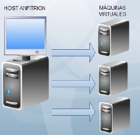{ width="300" } { width="260" }

!!! note
    Solo disponemos de **un** HOST anfitrión.

### Concepto de GUEST (invitado)

Cada **ordenador virtual** que creamos mediante el software de virtualización.

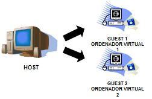{ width="380" }

!!! note
    Disponemos de tantos GUEST como máquinas virtuales creemos. **El límite lo ponen los recursos del anfitrión.**

### Recursos compartidos

Cada **GUEST** comparte los recursos hardware con el **HOST**:

| Recurso | Ejemplo |
|---|---|
| 🧠 Memoria RAM | Módulos DDR |
| 💾 Disco duro | HDD / SSD |
| ⚙️ Procesador | CPU Intel / AMD |
| 🖥️ Tarjeta gráfica | GPU |
| 🌐 Tarjeta de red | NIC |
| 📀 Otros dispositivos | DVD/CD-ROM, disquetera, USB… |

### ¿Cómo funciona realmente?

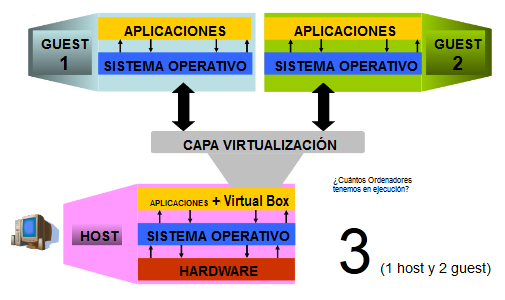{ width="600" }

**¿Cuántos ordenadores tenemos en ejecución?** → **3** (1 host + 2 guest).

### ✅ Ventajas

1. **Independencia:** una máquina virtual **no depende** del hardware ni del sistema operativo del HOST sobre el que se ejecuta. Se puede mover entre equipos distintos.
2. **Mejor aprovechamiento del HOST:** el hardware actual es muy potente, así que un único servidor físico puede alojar varios servicios:
   - GUEST 1 → Servidor de archivos
   - GUEST 2 → Servidor de bases de datos
   - GUEST 3 → Servidor de correo

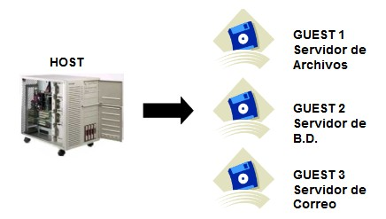{ width="320" } 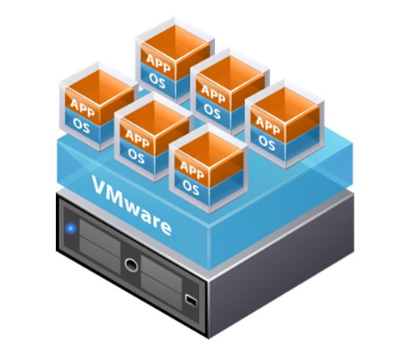{ width="240" }

3. **Control del estado:** una MV se puede encender (*Power On*), reiniciar (*Reset*), **suspender** (*Suspend*) y apagar (*Power Off*).

   { width="180" }

   - Al **suspender**, se guarda en un fichero el contenido de la memoria y se apaga.
   - Al **reanudar**, se recupera la memoria desde ese fichero y continuamos en el mismo estado en que estábamos.

### ❌ Desventajas

- Cuantos más sistemas virtualizados queramos tener, **más recursos y potencia** necesita el sistema anfitrión.
- Los factores que determinan cuántas MV se pueden soportar y su rendimiento son principalmente:
  - Cantidad y velocidad de la **memoria RAM**.
  - Potencia del **procesador**.
  - Velocidad de lectura, acceso y transferencia del **disco duro**.
- En ocasiones pueden aparecer **problemas de compatibilidad** con el hardware virtualizado (aunque en las versiones actuales casi no ocurre).

---

## 2. Máquinas virtuales de sistema

El **hardware subyacente** ejecuta varias máquinas virtuales, cada una con su propio sistema operativo y su propio hardware virtual (CPU, disco, red y memoria).

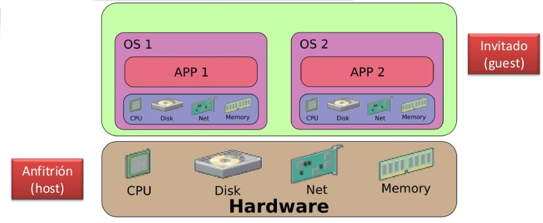{ width="600" }

### Tipo I — Directamente sobre el hardware (*bare metal*)

El **hipervisor** está incrustado en un sistema operativo muy ligero, de forma que los recursos físicos se aprovechan casi en su totalidad por los sistemas virtualizados.

**Ejemplos:** VMware vSphere ESXi, Proxmox.

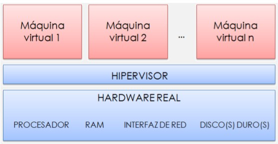{ width="550" }

**Ejemplo de uso (Proxmox):** desde la interfaz web se gestionan las máquinas virtuales y contenedores (iniciar, parar, abrir consola, migrar, ver uso de CPU/memoria, etc.).

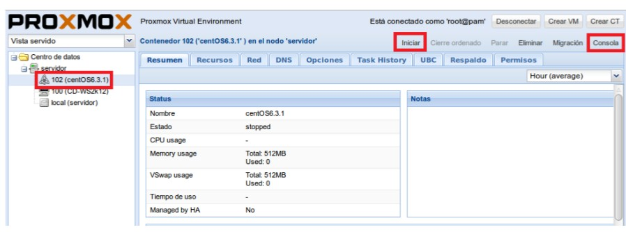{ width="650" }

**Arquitectura típica:**

- Uno o varios **servidores de virtualización**.
- Un **cliente de gestión vía web** que se conecta por red.
- En entornos de **alta disponibilidad** debe haber más de un servidor (normalmente **3**).

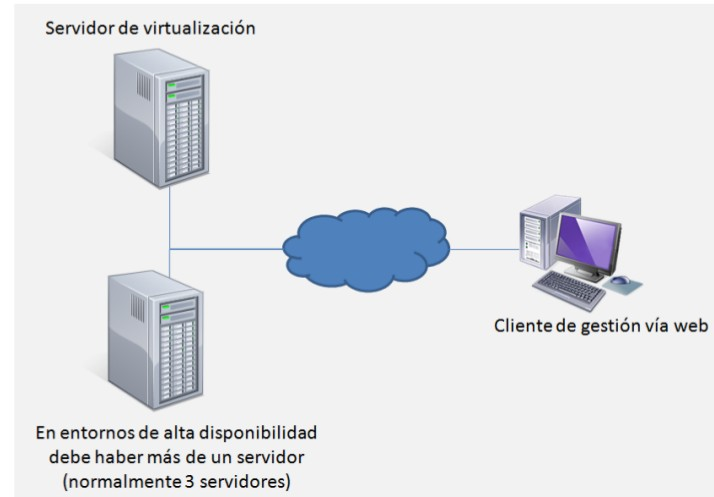{ width="500" }

### Tipo II — Sobre otro sistema operativo (*hosted*)

El **hipervisor es un programa más** que se ejecuta dentro del sistema operativo instalado.

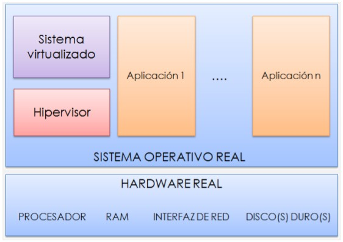{ width="550" }

**Ejemplos:** VirtualBox, VMware Workstation / Player, Parallels.

### Comparativa rápida Tipo I vs Tipo II

| Característica | Tipo I (bare metal) | Tipo II (hosted) |
|---|---|---|
| Se instala sobre | El hardware directamente | Un sistema operativo existente |
| Rendimiento | Muy alto | Menor (capa extra del SO) |
| Uso típico | Servidores, CPD, producción | Pruebas, formación, escritorio |
| Ejemplos | ESXi, Proxmox, Hyper-V, Xen | VirtualBox, VMware Workstation, Parallels |

### Hyper-V

* Hipervisor de tipo 1 de Microsoft, integrado en Windows Server desde la versión 2008 hasta la actual, Windows Server 2025 (se activa como un rol desde el Administrador del servidor).
* También está disponible como característica opcional en las ediciones Pro, Enterprise y Education de Windows 10 y Windows 11.
* En funcionalidad y capacidades compite con VMware vSphere y Proxmox VE, y está por encima de hipervisores de tipo 2 como VirtualBox.
* Distingue dos tipos de máquina virtual: generación 1 (BIOS, hardware emulado) y generación 2 (UEFI, arranque seguro), que es la opción por defecto desde Windows Server 2025.
* La versión de Windows Server 2025 permite, en máquinas de generación 2:
    * Discos duros virtuales (VHDX) de hasta 64 TB.
    * Hasta 240 TB de RAM por máquina virtual.
    * Hasta 2048 procesadores virtuales por máquina virtual.
* El host puede gestionar hasta 4 PB de RAM y 2048 procesadores lógicos.
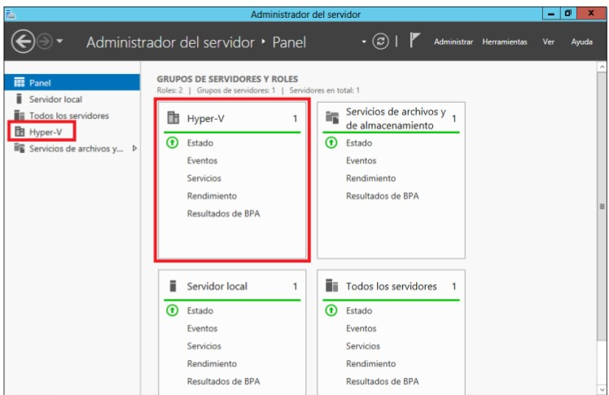{ width="550" }

- Para saber más: [Hyper-V en Microsoft Learn](https://learn.microsoft.com/es-es/windows-server/virtualization/hyper-v/hyper-v-overview) · [Hyper-V en Wikipedia](https://es.wikipedia.org/wiki/Hyper-V)

### MV de sistema más comunes

- VMware (vSphere / Workstation)
- VirtualBox
- Xen (paravirtualización)
- Parallels (macOS)
- Hyper-V

### Ventajas e inconvenientes

- ❌ Añaden complejidad en tiempo de ejecución.
- ❌ Ralentización del sistema.
- ✅ Su **flexibilidad compensa** esta pérdida de eficiencia.

---

## 3. Software de virtualización

### VMware

- **VMware Inc.** (VM de *Virtual Machine*), filial de EMC Corporation, proporciona la mayor parte del software de virtualización para ordenadores compatibles **x86**.
- Productos: **VMware Workstation** y los gratuitos **VMware Server** y **VMware Player**.
- Funciona en **Windows**, **Linux** y **macOS** con procesador Intel (bajo el nombre de **VMware Fusion**).
- *Ejemplo visto en clase:* Windows Server 2012 ejecutándose sobre Linux Mint con VMware Workstation Player.

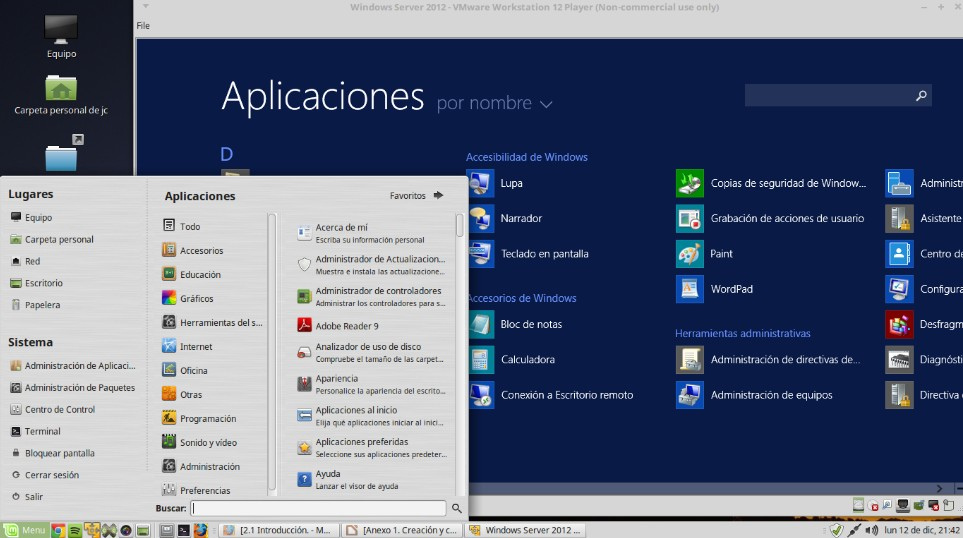{ width="650" }

!!! tip "Nota actualizada"
    Desde finales de 2023 VMware pertenece a **Broadcom**. VMware Server está descontinuado y VMware Player se ha integrado en Workstation.

### VirtualBox

- Software de virtualización de **Oracle**, gratuito y multiplataforma (Windows, Linux, macOS).
- Hipervisor de **tipo II**.
- Permite gestionar varias MV (Ubuntu, Windows XP, Solaris…) desde el *VirtualBox Manager*, con instantáneas (*snapshots*) y configuración de pantalla, almacenamiento, audio, red y USB.

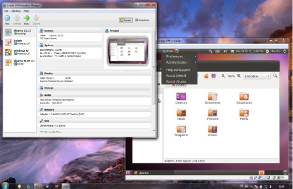{ width="650" }

---

## 4. Virtualización en la nube

### Ventajas e inconvenientes del Cloud

| ✅ Ventajas | Descripción |
|---|---|
| **Elasticidad y escalabilidad** | Permite aumentar los recursos de forma inmediata y sin afectar al usuario. |
| **Inmediatez** | Despliega sistemas que de otro modo tardarían semanas en implementarse. |
| **Costes** | A largo plazo, alojar los servicios virtuales en la nube es más económico. |
| **Equipo operativo** | No hay costes de equipos operativos: están incluidos en la suscripción. |
| **Acceso** | Se accede a los recursos desde cualquier sitio con Internet. |

| ❌ Inconvenientes | Descripción |
|---|---|
| **Protección de datos** | Los datos están expuestos a terceros; hay que revisar los acuerdos de protección de la información. |
| **Independencia** | Al necesitar conexión a Internet se pierde independencia de uso. |
| **Costes recurrentes** | Aunque a largo plazo es más barata, hay que pagar cuotas mensuales. |
| **Administración** | No se dispone de administración del servidor físico. |

### IaaS, PaaS y SaaS

Son distintos **niveles de servicio** en el Cloud (hay más, pero estos son los más habituales):

| Modelo | Significado | Qué ofrece | Ejemplos |
|---|---|---|---|
| **IaaS** | *Infrastructure as a Service* | Uso directo de **máquinas virtuales**. El cliente las crea y administra desde cero, instalando todo lo que necesite. | Amazon Web Services, Azure, Google Cloud |
| **PaaS** | *Platform as a Service* | La **infraestructura** necesaria para crear, testear e implementar aplicaciones en la nube. | Oracle Cloud Applications, Azure, Google App Engine |
| **SaaS** | *Software as a Service* | La **aplicación** ya funcionando en la nube. Sin trabajo de mantenimiento. | Gmail, Facebook… (cualquier app con usuario y contraseña) |

```text
  Más control del cliente  ◄──────────────────────────►  Menos gestión
        IaaS                       PaaS                       SaaS
   (tú gestionas SO,         (tú gestionas solo         (solo usas la
    apps y datos)             tu app y datos)             aplicación)
```

### AWS, Azure y Google Cloud

Los tres grandes proveedores:

* **AWS**: Amazon Web Services
* **Azure**: Microsoft Azure
* **Google Cloud**: Google

Cuota de mercado en infraestructura cloud (Q2 2026) — Fuente: Synergy Research Group, julio 2026

| Proveedor       | Cuota                     |
| --------------- | ------------------------- |
| AWS             | 28 %                      |
| Microsoft Azure | 20 %                      |
| Google Cloud    | 15 %                      |
| Otros           | 37 %                      |
| **Gasto total** | **143,4 mil millones US$** |

!!! note
    Los tres principales suman el 63 % del gasto total en cloud.

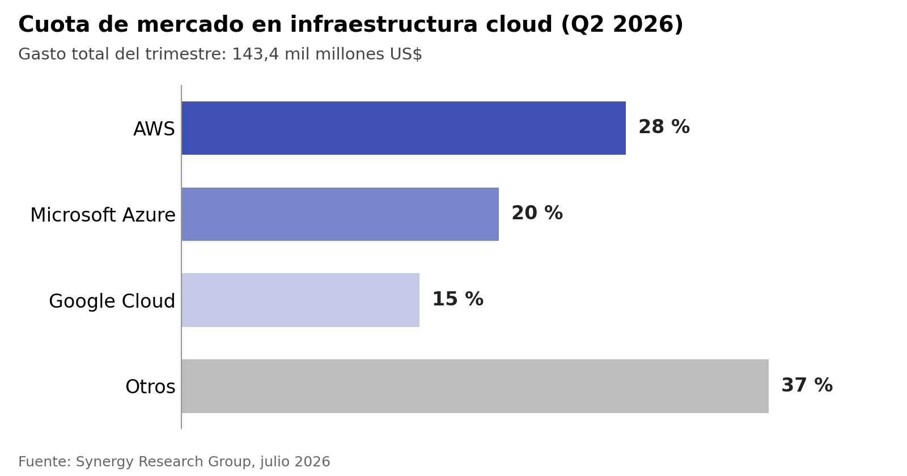


**¿Cuál elegir?**

- Los tres ofrecen prácticamente las mismas opciones: la elección depende de la **experiencia del equipo**, los **precios** y los **distribuidores** con los que se trabaje.
- **Azure:** destaca por su integración con **Active Directory** de Microsoft. Es la mejor opción para migrar un directorio a la nube, incluyendo VMware (*bare metal*).
- **AWS:** la opción más potente en **virtualización IaaS**, también con posibilidad de VMware (*bare metal*).
- **Google Cloud:** ofrece los **precios más competitivos**.

---

## 📌 Resumen / glosario

| Término | Definición |
|---|---|
| **Máquina virtual (MV)** | Software que emula el hardware de un ordenador completo. |
| **Host / anfitrión** | Equipo físico donde se ejecuta el software de virtualización. |
| **Guest / invitado** | Cada máquina virtual creada sobre el host. |
| **Hipervisor** | Capa de software que gestiona y reparte los recursos entre las MV. |
| **Tipo I (bare metal)** | Hipervisor instalado directamente sobre el hardware. |
| **Tipo II (hosted)** | Hipervisor que se ejecuta como una aplicación sobre un SO. |
| **IaaS / PaaS / SaaS** | Niveles de servicio en la nube: infraestructura, plataforma y software. |
