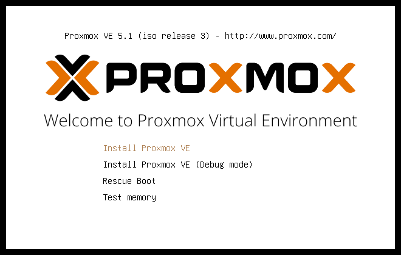
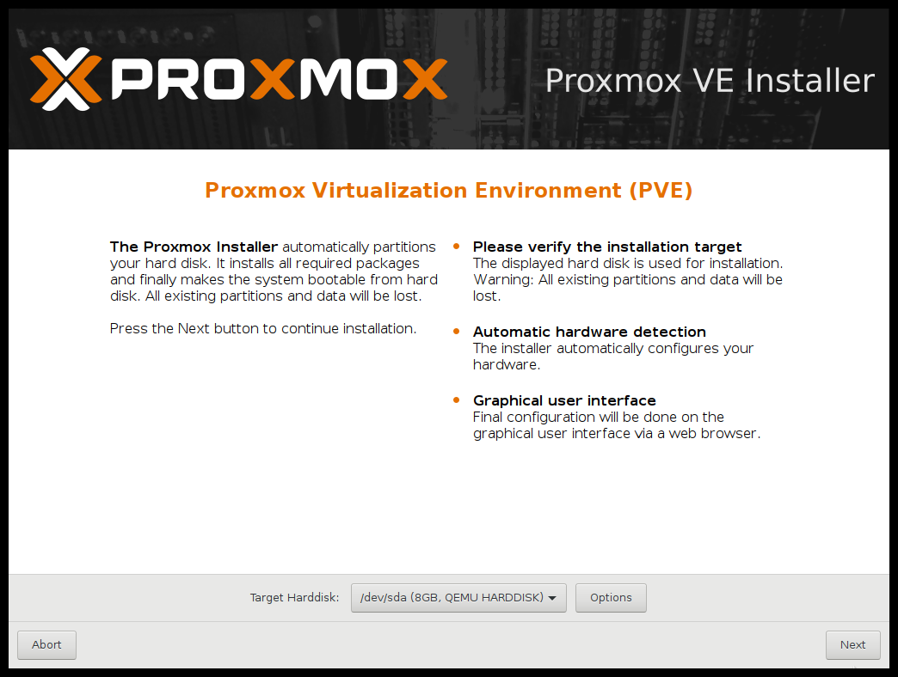
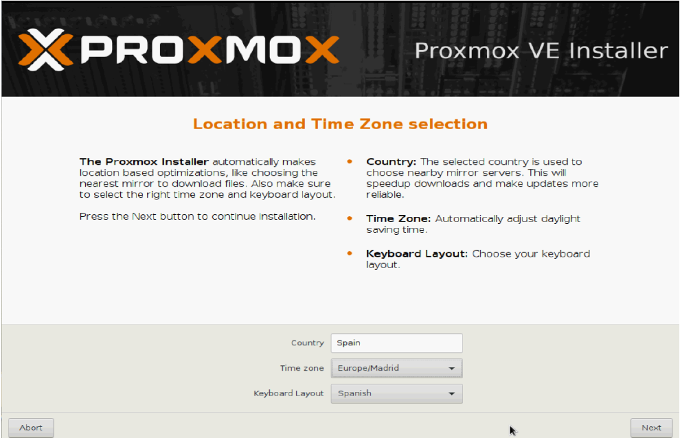
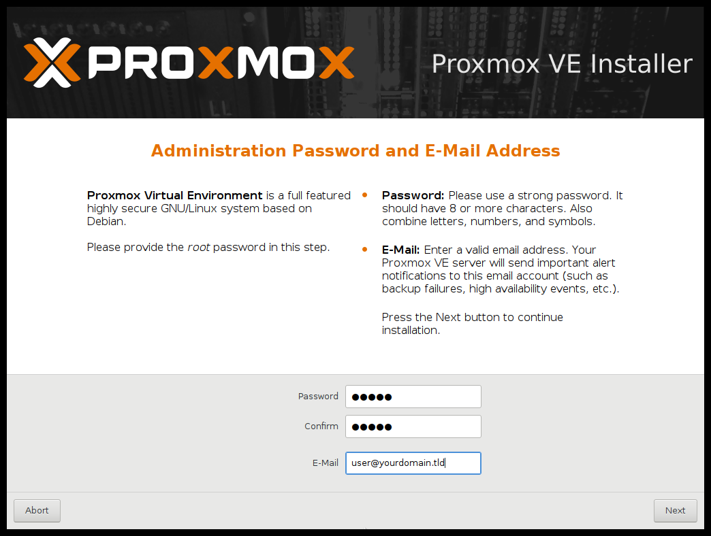
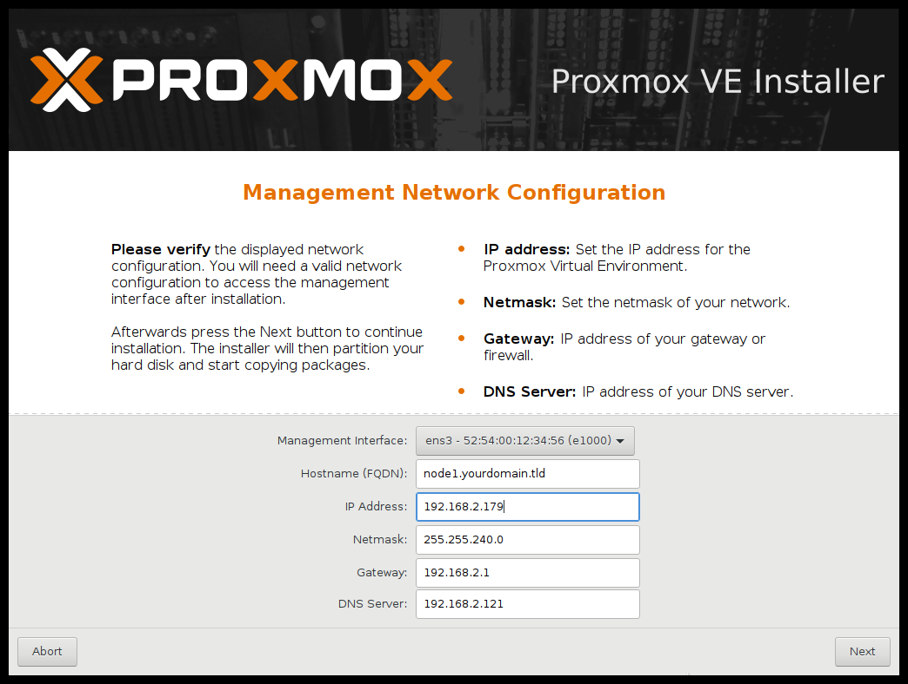
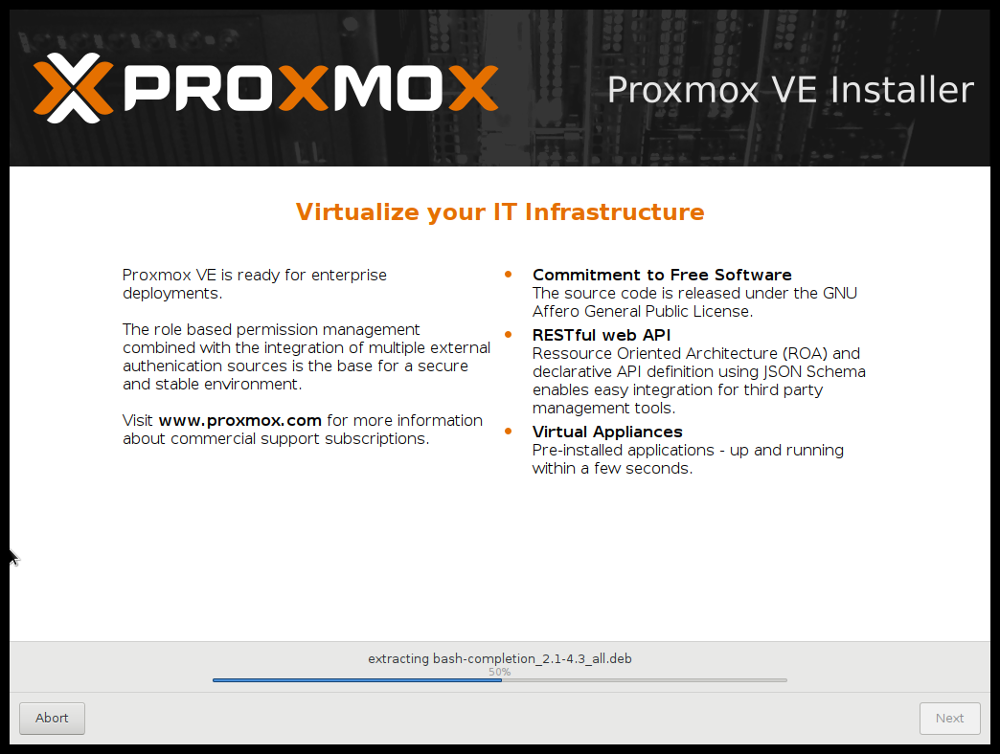
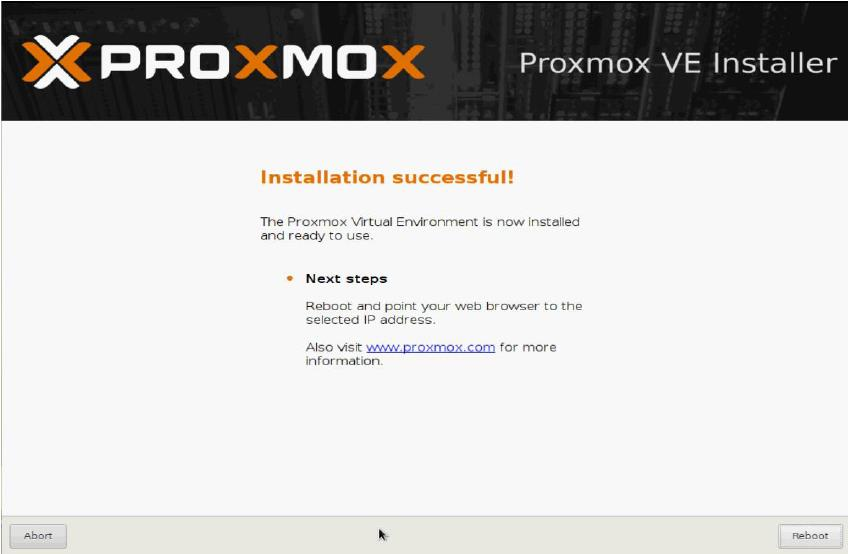
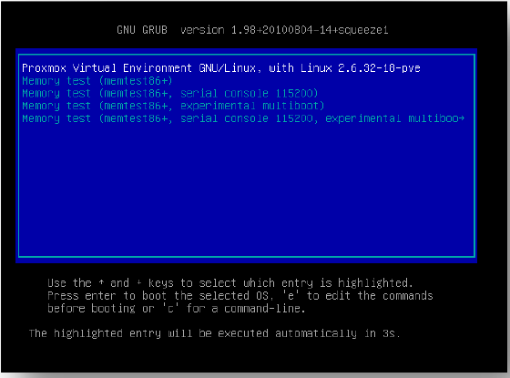
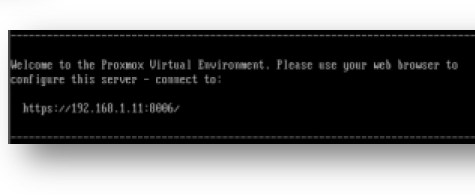
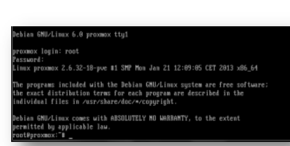

# 2.2 Proxmox VE

!!! abstract "En este apartado"
    1. [¿Qué es la virtualización y qué nos ofrece?](#que-es-la-virtualizacion-y-que-nos-ofrece)
    2. [¿Qué es Proxmox?](#que-es-proxmox)
    3. [Conceptos y funcionamiento](#conceptos-y-funcionamiento)
    4. [Tecnologías: KVM y LXC](#tecnologias-kvm-y-lxc)
    5. [Requisitos hardware](#requisitos-hardware)
    6. [Instalación de Proxmox](#instalacion-de-proxmox)
    7. [Actualización a la última versión](#actualizacion-a-la-ultima-version)
    8. [Estructura de archivos y directorios](#estructura-de-archivos-y-directorios)

---

## ¿Qué es la virtualización y qué nos ofrece?

La **virtualización** es una forma de dividir lógicamente los recursos de un servidor para ejecutar diferentes aplicaciones.

Con el aumento de los costes de energía, mantener servidores físicos infrautilizados ya no es un lujo que podamos permitirnos. La virtualización nos permite **hacer más con menos**: ahorramos energía y dinero, y conseguimos un centro de datos virtual, limpio y sin fronteras geográficas.

### El hipervisor

Un **hipervisor** es una pieza de software, hardware o firmware que **crea y administra máquinas virtuales**. Es el elemento básico de toda virtualización.

- Actúa como **puente** entre el hardware físico y las máquinas virtuales, creando una **capa de abstracción**.
- La máquina virtual **no ve el hardware directamente**: ve la capa del hipervisor, que es siempre la misma independientemente del hardware sobre el que esté instalado.
- Gracias a esto, una máquina virtual completa se puede **mover a otro servidor**, incluso a gran distancia a través de Internet, y funcionará exactamente igual que en local.

---

## ¿Qué es Proxmox?

!!! info "Definición"
    **Proxmox VE** (*Virtual Environment*) es una potente plataforma de virtualización de nivel empresarial, **100 % libre** y sin límites de uso.

- Ofrece soluciones similares a **VMware vSphere**, **Microsoft Hyper-V** o **Citrix XenServer** (la mayoría de pago), y en muchos escenarios incluye herramientas superiores.
- Integra de forma gratuita **copias de seguridad**, **clúster**, **almacenamiento distribuido** y muchas más soluciones.
- Se puede instalar en **cualquier número de servidores físicos**, sin límite de procesadores, sockets o conexiones de red, e integra almacenamiento **NAS o SAN** mediante Fibre Channel, iSCSI o NFS.
- Dispone de un servicio de **actualizaciones con licencia comercial** a un precio muy competitivo, recomendable para entornos de producción.

En su web oficial se puede descargar una **imagen ISO** para crear un instalador en CD o USB. La instalación se hace en un equipo vacío y en unos **15 minutos** tenemos un servidor (**nodo**) listo para alojar máquinas virtuales o para unirse a un **clúster**.

Este tipo de instalación se llama **bare-metal**: el instalador añade al equipo todo lo necesario y lo deja preparado para un entorno de producción. Es decir, Proxmox es un **hipervisor de tipo I**.

### ¿Qué define la libertad de Proxmox?

- Usa **Debian** como sistema base y, para virtualizar, **KVM** (máquinas virtuales) y **LXC** (contenedores). Toda la base es libre, por eso el producto final también lo es.
- Su **modelo de negocio** se basa en formación, certificaciones, soporte y **suscripciones** para acceder a las últimas actualizaciones estables.
- **Sin suscripción** también se puede usar sin problema: tendremos actualizaciones menos profundas (reparaciones y mejoras de paquetes pequeños), igual de fiables pero menores a nivel del hipervisor.
- Para **producción** se recomienda la suscripción comercial, ya que garantiza máxima estabilidad y las últimas actualizaciones, aunque no es obligatoria.

### ¿Qué nos ofrece esta solución?

| Característica | Descripción |
|---|---|
| **Administrador web HTML5** | Interfaz web para configurar servidores, clúster, MV, backups, restauraciones y snapshots. No hace falta instalar ningún cliente; funciona incluso desde el móvil o la tablet. |
| **Soporte multi-SO** | Virtualiza la mayoría de sistemas operativos de 32/64 bits: Linux, Windows (XP, 7, 8, 10, Server 2003–2016…), Solaris, AIX, etc. |
| **KVM** | Virtualización completa sobre Linux. Requiere un procesador con soporte **Intel VT** o **AMD SVM**. |
| **Contenedores LXC** | Ejecuta sistemas Linux en espacios aislados, haciendo uso directo del hardware del servidor. |
| **Backup & Restore** | Copias de seguridad inmediatas o programadas desde la web. Restaurar es tan fácil como elegir el backup. |
| **Snapshot en vivo** | Copias instantáneas de la MV (RAM, configuración y discos) para volver atrás en el tiempo. |
| **Migración en caliente** | Mover MV entre nodos **sin apagarlas**. |
| **Clúster de alta disponibilidad** | Reglas de HA, por ejemplo mover una MV a otro nodo con menos carga (**balanceo de carga**). |
| **Administración centralizada** | Un nodo actúa como **orquestador**, aunque cada nodo tiene su propia interfaz web. |
| **Clúster sin SPOF** | Sin punto único de fallo: si cae el orquestador, cualquier otro nodo tiene la información replicada y puede tomar el control. |
| **Puentes de red** | Las tarjetas físicas se gestionan mediante *bridges* compartidos con las MV. Se pueden agrupar varias tarjetas para balancear el tráfico. |
| **NAS y SAN** | Uso sencillo de almacenamiento por Fibre Channel, iSCSI o NFS. |
| **Almacenamiento distribuido** | Sistemas como **Ceph** o **DRBD** en cada nodo, con los datos replicados y tolerancia a fallos. |
| **Autenticación** | Cuentas propias de Proxmox o **LDAP / Active Directory**. |
| **Firewall** | Reglas para todas las MV o reglas específicas para una sola. |

---

## Conceptos y funcionamiento

- **Requisitos mínimos:** un procesador con **VT (Intel) o SVM (AMD)** y un equipo **vacío**. La instalación *bare-metal* borra el disco por completo, instala Debian con todo lo necesario y configura KVM.
- **Nodo:** cada máquina con Proxmox se convierte en un **nodo**, que puede trabajar de forma **independiente** o formar parte de un **clúster**.
- **Clúster:** agrupar nodos permite la **administración centralizada**, **mover máquinas** entre nodos, activar la **alta disponibilidad** y aprovechar todos los recursos físicos.
- **Almacenamiento compartido:** para usar **alta disponibilidad** y **migrar MV sin apagarlas** es imprescindible un almacenamiento compartido (**NAS o SAN**) o distribuido (tipo **Ceph**). Hay muchas alternativas, tanto propietarias como libres (por ejemplo, FreeNAS/TrueNAS).

!!! warning "Importante"
    Sin almacenamiento compartido o distribuido **no se pueden mover máquinas entre nodos** ni usar alta disponibilidad.

---

## Tecnologías: KVM y LXC

En Proxmox podemos usar dos tecnologías de virtualización. Elegiremos una u otra según nuestras necesidades.

### KVM (Kernel-based Virtual Machine)

- **Máquina virtual basada en el núcleo**: solución de **virtualización completa** con Linux.
- Está formada por un módulo del kernel y herramientas en el espacio de usuario. Está incluido en Linux desde la versión **2.6.20**.
- Ejecuta MV a partir de imágenes de disco con **sistemas operativos sin modificar** (Windows, Linux, BSD…).
- Cada MV tiene su **propio hardware virtualizado**: tarjeta de red, discos duros, tarjeta gráfica, etc.

### LXC (Linux Containers)

- Tecnología de virtualización **a nivel de sistema operativo** para Linux.
- Funciona como un módulo añadido al servidor físico y **usa directamente el hardware** (en el temario se relaciona con la paravirtualización).
- Permite que un servidor ejecute **múltiples instancias aisladas** de Linux, llamadas **Servidores Privados Virtuales (VPS)** o **Entornos Virtuales (EV)**.
- **No crea una máquina virtual**: crea un entorno virtual con su **propio espacio de procesos y de red**, pero **comparte el kernel** del anfitrión.
- Es similar a **OpenVZ** y **Linux-VServer**, y a los **FreeBSD jails** o **Solaris Containers**.
- Se basa en los **cgroups** del kernel de Linux (desde la versión **2.6.29**) y en los **espacios de nombres** (*namespaces*) para aislar procesos.

### Comparativa KVM vs LXC

| | **KVM** | **LXC** |
|---|---|---|
| Tipo | Virtualización completa | Contenedores (nivel de SO) |
| Kernel | Cada MV tiene el suyo | Comparten el del anfitrión |
| Sistemas operativos | Cualquiera (Windows, Linux, BSD…) | Solo Linux |
| Rendimiento | Muy bueno | Casi nativo (más ligero) |
| Aislamiento | Total | Menor (comparten kernel) |
| Requiere VT/SVM | Sí | No |
| Uso típico | Servidores Windows, SO completos | Servicios Linux ligeros (web, DNS…) |

---

## Requisitos hardware

Además de un procesador con **VT o SVM**, para sacar rendimiento a Proxmox se recomienda:

| Componente | Recomendación |
|---|---|
| **Procesador** | Rápido y multinúcleo/multihilo (i7 o superior), en uno o varios sockets. |
| **RAM** | **8 GB como mínimo**; cuanta más, mejor. |
| **Discos** | Al menos **1** para el sistema (puede ir incluso en USB o CF), pero lo recomendable son **varios** para RAID por software o almacenamiento distribuido (Ceph, DRBD…). Mejor discos rápidos y una controladora con caché. Si usamos almacenamiento distribuido, al menos un **SSD** para cachés o MV rápidas. |
| **Red** | Al menos **1** tarjeta, recomendable **4 o más** para crear distintos *bridges*, usar **STP** (Spanning Tree) y **bonding** (tarjetas redundadas) con varios caminos hacia el almacenamiento. |

!!! tip "Servidores frente a equipos montados"
    En la medida de lo posible, usa **servidores** en lugar de equipos montados por piezas. Sus componentes están pensados para funcionar juntos, durante mucho tiempo y con cargas altas. Un equipo "ensamblado" también es válido, pero requerirá más pruebas para dar con una combinación de hardware y drivers estable.

---

## Instalación de Proxmox

Necesitamos un **USB arrancable** o un **CD/DVD** con la ISO de Proxmox.

!!! warning "BIOS"
    En algunos servidores es necesario cambiar algún parámetro de la BIOS para que sea compatible con los drivers de la instalación *bare-metal* (y, por supuesto, activar la virtualización **VT/SVM**).

**1. Menú de arranque.** Arrancamos desde el USB/DVD y elegimos **Install Proxmox VE**.

{ width="500" }

**2. Licencia y disco de destino.** Tras revisar el hardware, aceptamos la licencia y elegimos el **disco** donde se instalará el sistema.

{ width="600" }

Con el botón **Options** del *Target Harddisk* podemos elegir cómo se instala:

- Si la controladora **no soporta RAID**, podemos hacer **RAID por software con ZFS** (heredado de Solaris) en distintos niveles (RAID 1, 5, 10…).
- También podemos instalar en un disco simple, una tarjeta SD, etc.

!!! tip "Recomendación: RAID 1 para el sistema"
    Instalar el sistema en **RAID 1** (por hardware o por software) permite seguir funcionando si falla un disco, sustituirlo y continuar. Los discos son baratos: con **70–128 GB** en RAID 1 (SSD, SAS o SATA) basta para el sistema, y los discos más grandes se dejan para las MV o para el almacenamiento distribuido (Ceph, DRBD, GlusterFS…).

**3. País, zona horaria y teclado.**

{ width="600" }

**4. Contraseña de root y correo electrónico** para las notificaciones.

{ width="600" }

**5. Configuración de red:** interfaz de gestión, nombre del equipo (FQDN), IP, máscara, puerta de enlace y DNS.

{ width="600" }

!!! note
    Apunta bien la **IP** que pongas aquí: es la que usarás para entrar a la interfaz web.

**6. Instalación.** El instalador copia y configura todo lo necesario.

{ width="600" }

**7. Reinicio.** Al terminar, reiniciamos el equipo.

{ width="600" }

**8. GRUB.** Al arrancar aparece el menú de GRUB. La opción resaltada es la que usaremos: si dejamos pasar el tiempo entra sola, o podemos pulsar **Enter**.

{ width="500" }

**9. Mensaje de bienvenida.** Antes de iniciar sesión, la consola muestra la **URL** para acceder a la interfaz web, con la IP que configuramos en el paso 5.

{ width="500" }

!!! info "Acceso web"
    La dirección tiene el formato **`https://IP:8006`** (por ejemplo `https://192.168.1.11:8006`). El navegador avisará de que el certificado no es de confianza; es normal, porque es autofirmado.

**10. Inicio de sesión.** Entramos con el usuario **`root`** y la contraseña del paso 4. ¡Ya tenemos Proxmox funcionando!

{ width="500" }

---

## Actualización a la última versión

Actualizar Proxmox periódicamente nos asegura un software **estable**, **sin fallos de seguridad** y lo más **optimizado** posible.

### ¿Cuál es el proceso de actualización?

Como Proxmox está instalado sobre **Debian GNU/Linux**, basta con ejecutar:

```bash
apt-get update
apt-get dist-upgrade
```

Esto actualiza **todo el sistema**: nuevas versiones de Proxmox, el **kernel** (que es especial para Proxmox) y cualquier paquete pendiente. El sistema de paquetes de Debian resuelve las dependencias, así que podemos actualizar sin miedo a provocar fallos críticos.

### ¿Cada cuánto tiempo se debe actualizar?

- Como **mínimo una vez al mes**, para aplicar las nuevas versiones de Proxmox.
- Además, **siempre que se publique un fallo de seguridad grave**.

!!! warning "Actualizaciones automáticas"
    Aunque en entornos con muchos servidores es habitual automatizar las actualizaciones, **no se recomienda** en Proxmox: las actualizaciones (sobre todo las del kernel) pueden dar problemas.

### ¿Cuándo pasar a una nueva versión de Proxmox?

Cada cierto tiempo sale una **versión mayor**, con cambios importantes (nueva interfaz web, nueva API…).

- **No actualices en cuanto sale.** Espera un tiempo prudencial a ver la experiencia de los primeros usuarios.
- Si quieres probar las novedades, instálala en un **servidor de pruebas**, nunca directamente en producción.

### ¿Qué hay que tener en cuenta al actualizar?

- Especial cuidado con las **actualizaciones del kernel**: en el pasado han provocado fallos de arranque, un problema grave si gestionamos el servidor en remoto.
- **Reinicia** el servidor tras actualizar el kernel, de forma **controlada** (por ejemplo, de noche, para no afectar a los usuarios).
- Si algo falla, podemos **arrancar con el kernel anterior**: los kernels antiguos no se borran, se quedan "aparcados".

### Actualizar sin suscripción

Si no tenemos soporte comercial, hay que cambiar los repositorios para evitar los errores de *"no subscription"*:

1. En `/etc/apt/sources.list.d/pve-enterprise.list`, **comentamos** la línea del repositorio de pago:

    ```text
    #deb https://enterprise.proxmox.com/debian/pve stretch pve-enterprise
    ```

2. En `/etc/apt/sources.list.d/pve-no-subscription.list`, **quitamos la `#`** de la línea del repositorio gratuito:

    ```text
    deb http://download.proxmox.com/debian/pve stretch pve-no-subscription
    ```

3. Descargamos las claves públicas del repositorio:

    ```bash
    wget -O- http://download.proxmox.com/debian/key.asc | apt-key add -
    ```

!!! tip "Nota actualizada"
    Los ejemplos anteriores son de **Proxmox VE 5** (Debian *stretch*). En versiones actuales cambia el nombre de la versión de Debian (por ejemplo, *bookworm* en Proxmox VE 8) y el formato de algunos archivos, y `apt-key` está obsoleto. La forma más sencilla hoy es ir a **Nodo → Updates → Repositories** en la interfaz web, desactivar el repositorio *enterprise* y añadir el *No-Subscription* con el botón **Add**.

---

## Estructura de archivos y directorios

Tras la instalación, Proxmox crea una estructura de directorios que conviene conocer para gestionar el sistema.

| Directorio | Uso |
|---|---|
| `/etc/pve` | Configuración del sistema de virtualización |
| `/var/log/pve*` | Archivos de log |
| `/usr/share/doc/pve-*` | Documentación sobre Proxmox |
| `/usr/share/pve-manager` | Archivos de la interfaz web |
| `/var/lib/rrdcached/` | Información MRTG para las gráficas |
| `/usr/share/qemu-server/` | Configuraciones de USB para KVM |

??? note "`/etc/pve` — Configuración"
    Contiene los archivos de configuración del host: la de la interfaz web (usuarios, permisos…) y la de cada máquina virtual o contenedor.

    | Archivo / directorio | Contenido |
    |---|---|
    | `datacenter.cfg` | Configuración general del nodo / centro de datos |
    | `nodes/` | Directorio con los nodos del clúster |
    | `local` | Enlace al directorio del nodo local |
    | `qemu-server` | Enlace a los archivos de configuración de las MV **KVM** |
    | `lxc` | Enlace a los archivos de configuración de los contenedores **LXC** |
    | `storage.cfg` | Almacenamientos creados |
    | `user.cfg` | Usuarios autorizados en la web |
    | `.version` | Versiones de modificación de los archivos de configuración |
    | `vzdump.cron` | Crontab con la programación de las copias de seguridad |

??? note "`/var/log/pve*` — Logs"
    Todos los registros del servidor están en `/var/log`:

    - `pveam.log`: registro general, primer sitio donde buscar fallos.
    - `pve-firewall.log*`: estado y mensajes importantes del cortafuegos integrado.
    - `pveproxy/`: accesos al proxy de Proxmox, es decir, a la interfaz web.
    - `pve/`: registros de las tareas realizadas por el sistema.

??? note "`/usr/share/doc/*pve*` — Documentación"
    Documentación de los paquetes instalados. Suele incluir los últimos cambios, detalles técnicos y ejemplos que aún no están en el manual o en las páginas `man`.

??? note "`/usr/share/pve-manager` — Interfaz web"
    Archivos de la interfaz web de Proxmox. Se pueden modificar, pero **no se recomienda**: las actualizaciones pueden sobrescribirlos sin previo aviso.

??? note "`/var/lib/rrdcached/` — Gráficas"
    Estadísticas de uso del servidor, las MV, los volúmenes, etc. (información MRTG), con las que se generan las gráficas de rendimiento.

??? note "`/usr/share/qemu-server` — USB en KVM"
    Archivos de configuración para dispositivos USB en KVM.

---

## 📌 Resumen

| Término | Definición |
|---|---|
| **Proxmox VE** | Plataforma de virtualización libre, tipo I (*bare-metal*), basada en Debian. |
| **Nodo** | Cada servidor físico con Proxmox instalado. |
| **Clúster** | Grupo de nodos con administración centralizada, migración de MV y alta disponibilidad. |
| **KVM** | Virtualización completa: cada MV tiene su propio kernel y hardware virtual. |
| **LXC** | Contenedores Linux que comparten el kernel del anfitrión. |
| **HA** | Alta disponibilidad: las MV se mueven a otro nodo si uno falla. Requiere almacenamiento compartido. |
| **Ceph / DRBD** | Sistemas de almacenamiento distribuido y replicado entre nodos. |
| **Puerto 8006** | Puerto de la interfaz web: `https://IP:8006`. |
