# 2.3 Amazon Web Services (AWS)

!!! info ""
    **Autora del material original:** Ángela Bañuls Serrano  
    **Ciclo:** CFGS Administración de Sistemas Informáticos en Red

!!! abstract "En este apartado"
    1. [Introducción](#introduccion)
    2. [Servicios principales de AWS](#servicios-principales-de-aws)
    3. [Infraestructura global](#infraestructura-global-de-aws)
    4. [Servicios de red: VPC, subredes, tablas de rutas e Internet Gateway](#servicios-de-red-en-aws)
    5. [Computación: instancias EC2](#computacion-en-aws-instancias-ec2)
    6. [Elastic Block Store (EBS)](#elastic-block-store-ebs)
    7. [Balanceo de carga y Auto Scaling](#balanceo-de-carga-y-auto-scaling)

    **Ejercicios:** [1. VPC y subredes](#ejercicio-1-crear-una-vpc-y-4-subredes) ·
    [2. Tablas de rutas](#ejercicio-2-crear-las-tablas-de-enrutamiento) ·
    [3. Internet Gateway](#ejercicio-3-crear-y-conectar-el-internet-gateway) ·
    [4. Instancia EC2](#ejercicio-4-crear-una-instancia-ec2) ·
    [5. Servidor web](#ejercicio-5-instalar-un-servidor-web) ·
    [6. Load Balancer](#ejercicio-6-configurar-un-application-load-balancer) ·
    [7. Auto Scaling](#ejercicio-7-crear-un-auto-scaling-group)

---

## Introducción

**AWS** es la plataforma de computación en la nube líder a nivel mundial. Ofrece una enorme cantidad de servicios, desde almacenamiento y bases de datos hasta aprendizaje automático e inteligencia artificial.

Los servicios se agrupan en estas categorías principales:

| Categoría | Servicios |
|---|---|
| **Computación** | EC2, Lambda, ECS (*Elastic Container Service*), EKS (*Elastic Kubernetes Service*) |
| **Almacenamiento** | S3, EBS, EFS |
| **Redes y entrega de contenido** | VPC, CloudFront, Route 53 (DNS) |
| **Bases de datos** | RDS (relacionales), DynamoDB (no relacionales), Redshift |
| **Herramientas para desarrolladores** | CodeCommit, CodePipeline, CodeBuild |
| **Herramientas de administración** | CloudWatch, CloudTrail, Config |
| **Otros servicios** | Machine Learning, IoT, Lex |

---

## Servicios principales de AWS

AWS se organiza en capas. En este apartado nos centramos en los **servicios básicos** (marcados en rojo): **computación, redes y almacenamiento**, que se apoyan sobre la infraestructura de **regiones**, **zonas de disponibilidad** y **localizaciones periféricas**.

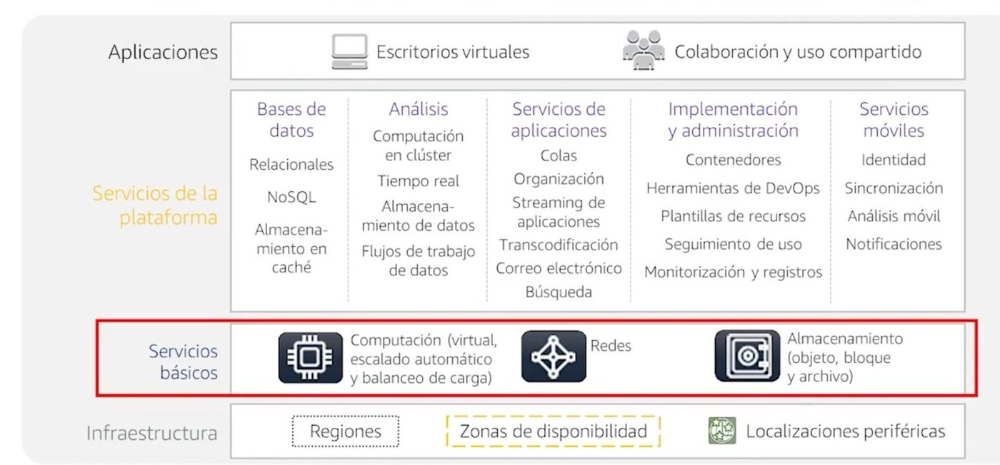{ width="700" }

Los servicios con los que trabajaremos son:

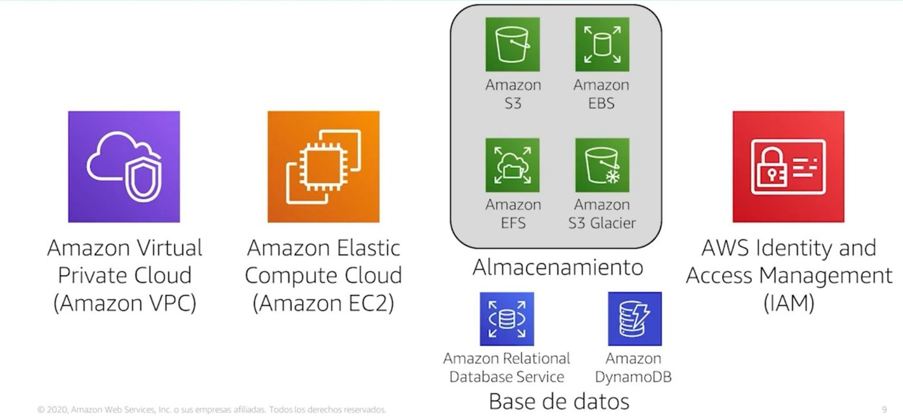{ width="700" }

| Servicio | Para qué sirve |
|---|---|
| **Amazon VPC** | Red privada virtual en la nube |
| **Amazon EC2** | Máquinas virtuales (instancias) |
| **S3 / EBS / EFS / S3 Glacier** | Almacenamiento de objetos, de bloques (discos), de archivos y de archivado |
| **RDS / DynamoDB** | Bases de datos relacionales y NoSQL |
| **IAM** | Gestión de identidades y permisos de acceso |

---

## Infraestructura global de AWS

La infraestructura global de AWS ofrece un entorno en la nube **flexible, escalable y seguro**, con una red global de alto rendimiento.

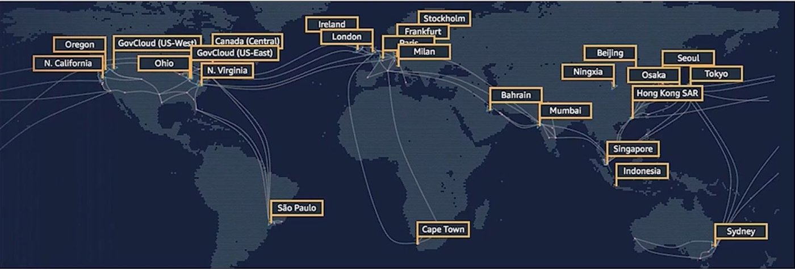{ width="750" }

### Regiones

Una **región** es un **área geográfica** (por ejemplo, Irlanda, Frankfurt o Norte de Virginia).

- La **replicación de datos entre regiones no es automática**: la tenemos que gestionar nosotros.
- La comunicación entre regiones usa la **red troncal** de AWS.
- Cada región ofrece redundancia y conectividad completas.
- Una región está formada por **dos o más zonas de disponibilidad**.

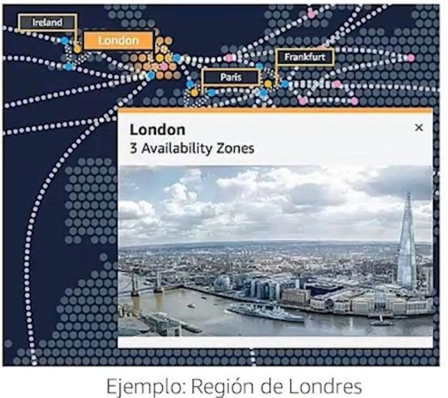{ width="400" }

### Zonas de disponibilidad (AZ)

Cada **zona de disponibilidad** es una partición aislada de la infraestructura de AWS dentro de una región.

- Hay **más de 100** zonas de disponibilidad en todo el mundo.
- Están formadas por uno o varios **centros de datos independientes**.
- Están diseñadas para **aislar errores**: si falla una, las demás siguen funcionando.
- Se interconectan entre sí con una **red de alta velocidad**.
- **Tú eliges** en qué zonas despliegas tus recursos.
- Para lograr **resiliencia**, AWS recomienda replicar los datos entre zonas.

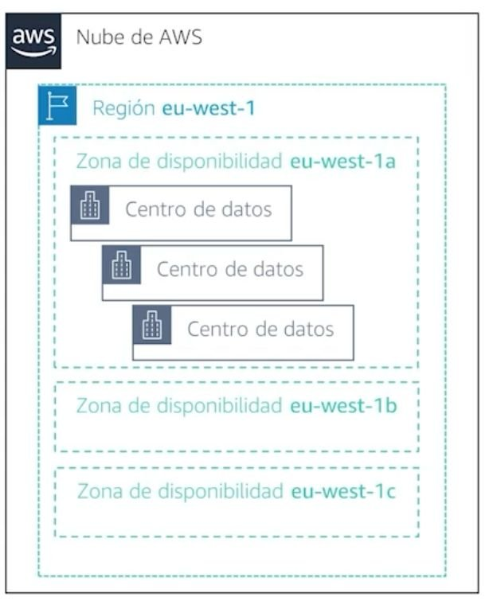{ width="350" }

!!! tip "Nomenclatura"
    Las regiones tienen códigos como `eu-west-1` (Irlanda) o `us-east-1` (Norte de Virginia), y sus zonas añaden una letra: `eu-west-1a`, `eu-west-1b`…

---

## Servicios de red en AWS

Los principales servicios de red son **Amazon VPC**, **Route 53** (DNS), **AWS Direct Connect** (conexión dedicada con nuestro centro de datos) y **AWS VPN**.

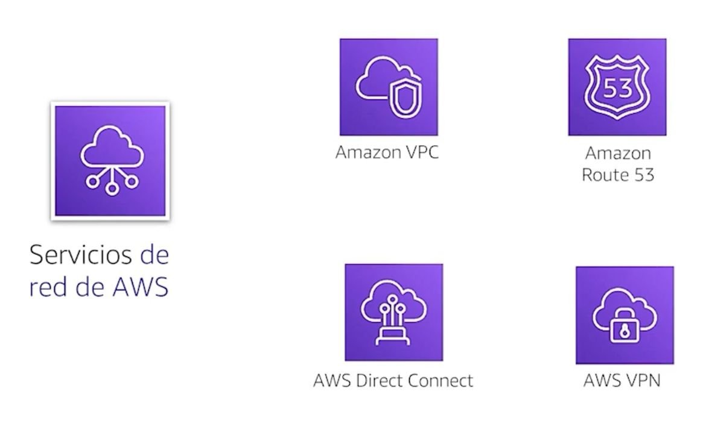{ width="550" }

### VPC (Virtual Private Cloud)

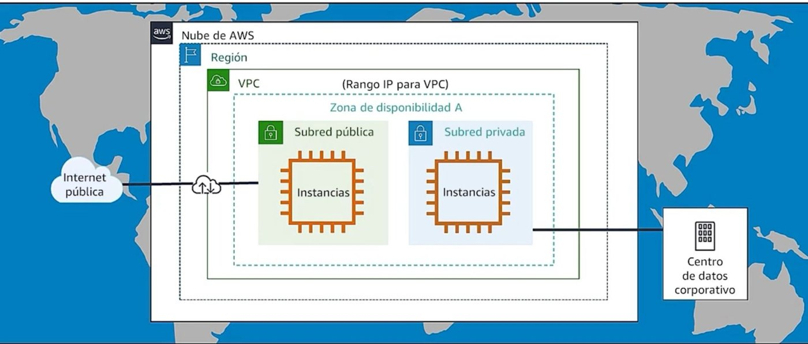{ width="750" }

- Es un **segmento de red completamente aislado**.
- Usa **direccionamiento privado**.
- Permite **segmentar** la arquitectura en redes distintas y gestionar qué ve cada una.
- Puede tener **acceso directo a Internet o no**.
- Permite comunicar recursos de AWS **sin usar IP públicas**.
- Es de **alcance regional**.

### Subredes (subnets)

- Son **pequeños segmentos de red dentro de la VPC**.
- Podemos crear todas las que necesitemos mientras queden **bloques CIDR** libres en la VPC.
- Pueden estar comunicadas entre ellas o no.
- Son de **alcance zonal**: cada subred está en una sola zona de disponibilidad.
- **No se pueden modificar** una vez creadas.

!!! note "Subred pública vs privada"
    Una subred es **pública** si su tabla de rutas envía el tráfico de Internet (`0.0.0.0/0`) a un **Internet Gateway**. Si no, es **privada**.

### 🧪 Ejercicio 1: Crear una VPC y 4 subredes

**1. Crear la VPC** en **VPC → Sus VPC → Crear VPC**:

| Campo | Valor |
|---|---|
| Recursos que se van a crear | **Solo la VPC** |
| Etiqueta de nombre | `iso` |
| Bloque CIDR IPv4 | Entrada manual → `10.0.0.0/16` |
| Bloque CIDR IPv6 | Sin bloque de CIDR IPv6 |

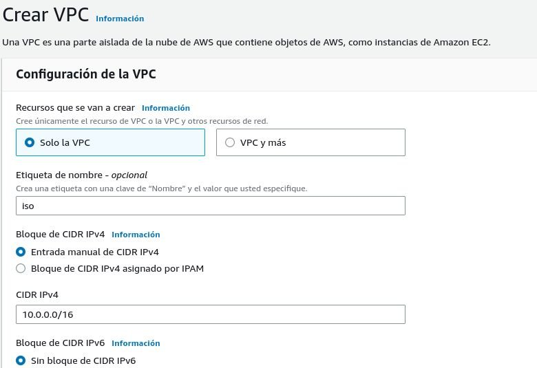{ width="550" }

Este es el esquema que vamos a montar: 2 subredes públicas y 2 privadas, repartidas en dos zonas de disponibilidad.

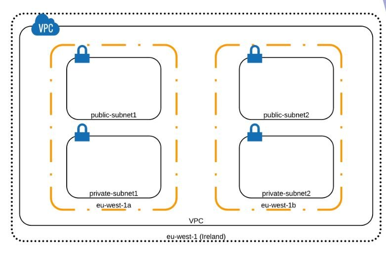{ width="600" }

**2. Crear las 4 subredes** en la VPC `iso`:

| Nombre | CIDR | Zona de disponibilidad |
|---|---|---|
| `public1` | `10.0.1.0/24` | `us-east-1a` |
| `public2` | `10.0.2.0/24` | `us-east-1b` |
| `private1` | `10.0.3.0/24` | `us-east-1a` |
| `private2` | `10.0.4.0/24` | `us-east-1b` |

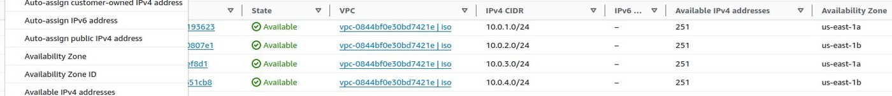{ width="750" }

!!! info "¿Por qué 251 direcciones y no 256?"
    En cada subred, AWS **reserva 5 direcciones**: la de red, la del router de la VPC, la del DNS, una reservada para uso futuro y la de broadcast.

!!! note "Región del laboratorio"
    Los diagramas usan `eu-west-1` (Irlanda), pero las capturas del laboratorio están hechas en **Norte de Virginia** (`us-east-1`). Usa las zonas de la región en la que trabajes.

**3. Asignar IP pública automáticamente** en las subredes **públicas**: selecciona cada subred pública → **Acciones → Editar la configuración de la subred** → marca **Habilitar la asignación automática de la dirección IPv4 pública**.

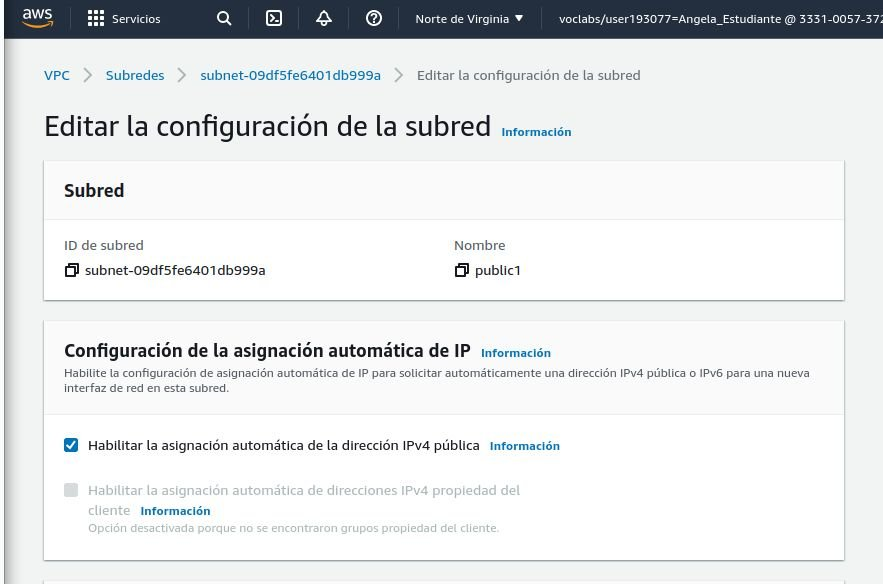{ width="550" }

### Tablas de enrutamiento

- Se usan para **enrutar el tráfico** dentro de las VPC.
- Al crear una VPC se crea una **tabla por defecto** (la *principal*).
- Se pueden crear **varias** y asociar cada subred a la que queramos.
- Lo recomendable es tener **al menos una tabla para las subredes públicas y otra para las privadas**.

### 🧪 Ejercicio 2: Crear las tablas de enrutamiento

**1. Crear dos tablas** en **VPC → Tablas de enrutamiento → Crear tabla de enrutamiento**: `route-public` y `route-private`, ambas en la VPC `iso`.

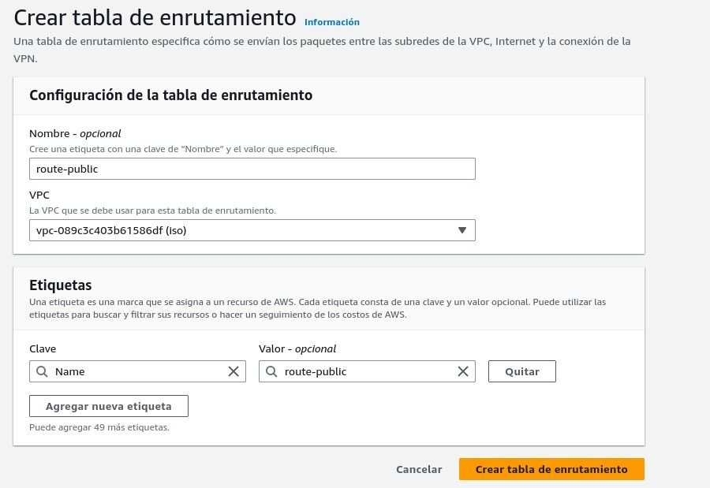{ width="600" }

Al final tendremos **tres tablas**: la principal (creada automáticamente con la VPC) y las dos nuestras.

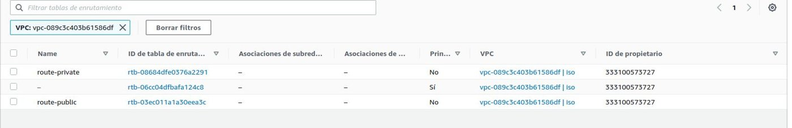{ width="750" }

**2. Asociar las subredes:** selecciona la tabla → pestaña **Asociaciones de subredes → Editar asociaciones de subredes**.

- `route-public` → `public1` y `public2`
- `route-private` → `private1` y `private2`

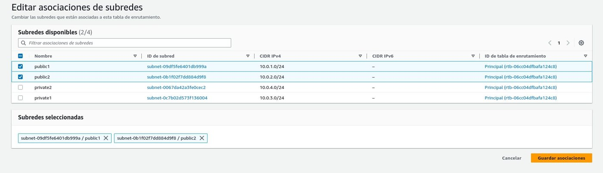{ width="750" }

!!! info "Aclaración"
    Por defecto, todas las instancias de una VPC **ya se comunican entre sí** con sus IP privadas, estén en subredes públicas o privadas (gracias a la ruta `local`). Para **salir a Internet** hace falta configurar algo más: el Internet Gateway.

### Internet Gateway (IGW)

- Es el **punto de conexión de la VPC con Internet**.
- Se **referencia en la tabla de rutas**.
- Solo pueden llegar a Internet los recursos que tengan **IP pública**.
- Lo **gestiona y escala AWS**; no requiere configuración.
- Solo puede haber **un IGW conectado a cada VPC**.

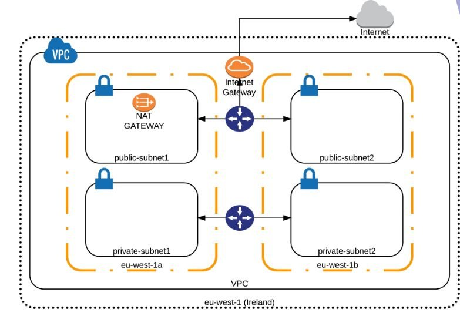{ width="600" }

!!! tip "¿Y el NAT Gateway del diagrama?"
    Las instancias de las subredes **privadas** no tienen IP pública. Si necesitan salir a Internet (por ejemplo, para actualizarse) se usa un **NAT Gateway** colocado en una subred pública.

### 🧪 Ejercicio 3: Crear y conectar el Internet Gateway

**1. Crear el IGW** en **VPC → Gateways de Internet → Crear gateway de Internet**, con el nombre `iso-gateway`.

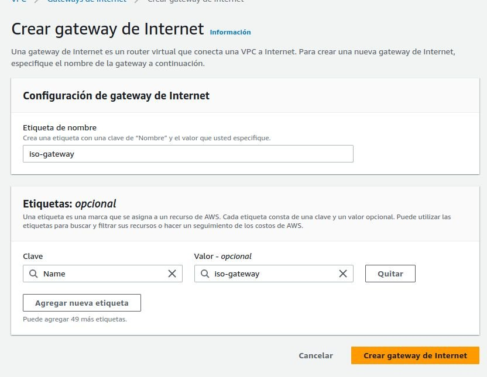{ width="550" }

**2. Conectarlo a la VPC:** selecciona `iso-gateway` → **Acciones → Conectar a la VPC** → elige `iso`. Su estado pasará de *Detached* a *Attached*.

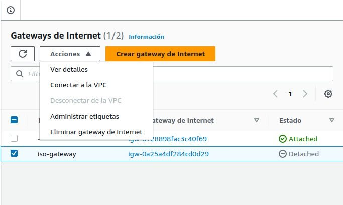{ width="500" }

**3. Añadir la ruta por defecto en la tabla pública:** selecciona `route-public` → pestaña **Rutas → Editar rutas → Agregar ruta**.

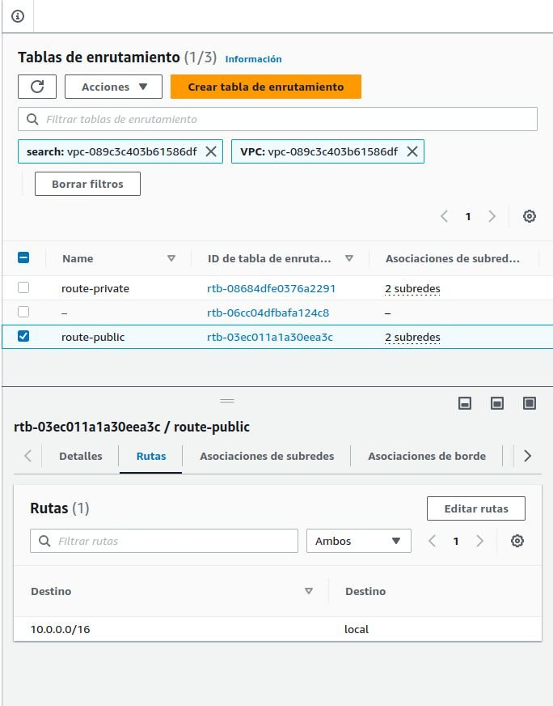{ width="350" } 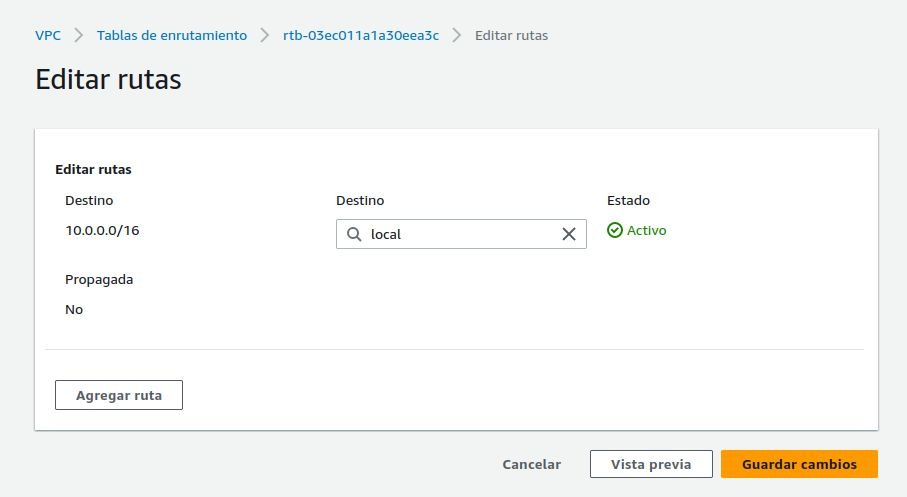{ width="450" }

| Destino | Objetivo |
|---|---|
| `10.0.0.0/16` | `local` (ya existe) |
| `0.0.0.0/0` | **Puerta de enlace de Internet** → `iso-gateway` |

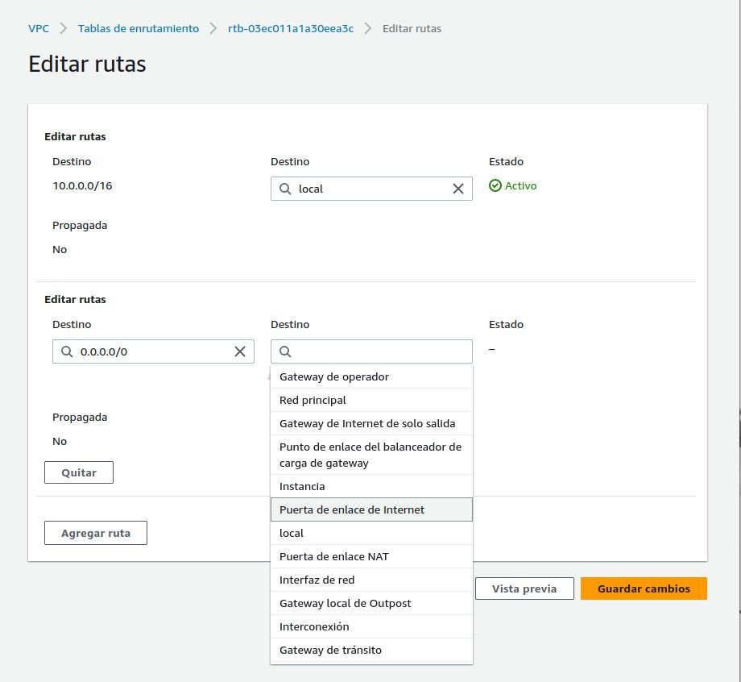{ width="400" } 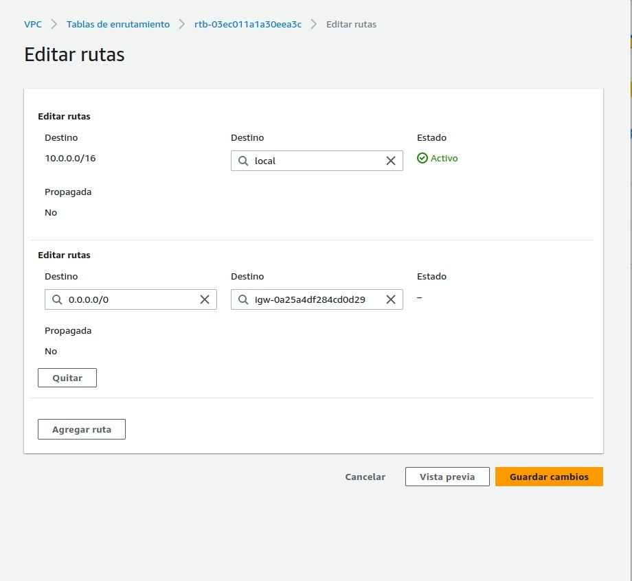{ width="400" }

Pulsa **Guardar cambios**. Ahora las subredes `public1` y `public2` ya son realmente públicas.

---

## Computación en AWS: instancias EC2

### Tipos y clases de instancias

- Las máquinas virtuales de AWS se llaman **instancias EC2**.
- Se pagan **por tiempo encendidas**.
- Hay distintas **gamas y tamaños**.
- Siempre parten de una **AMI** (*Amazon Machine Image*), la plantilla con el sistema operativo.
- Para lanzar una instancia necesitamos como mínimo: una **AMI**, una **VPC**, un **Security Group**, un disco **EBS** y una **clave de acceso SSH o RDP**.

### Modos de uso (compra)

| Modo | Características |
|---|---|
| **On-Demand** | Se paga por tiempo encendida. Se puede apagar en cualquier momento. |
| **Reserved** | Se reservan por **1 o 3 años**. Suelen ser entre un **50 y un 70 % más baratas** que las On-Demand. |
| **Spot** | Las **más baratas**: aprovechan capacidad sobrante de AWS. A cambio, **AWS puede apagarlas en cualquier momento**. |

!!! note "Instancias Spot"
    Antiguamente se "pujaba" por las instancias Spot. Hoy se paga el precio Spot vigente, con descuentos de hasta el 90 % respecto a On-Demand.

### Familias de instancias

- Las familias se diferencian en la proporción de **CPU, RAM, GPU, red y almacenamiento**.
- El tipo se elige al crear la instancia (`t2`, `m5`, `c5`…).
- Se puede **cambiar después**, pero requiere **detener y arrancar** la instancia.

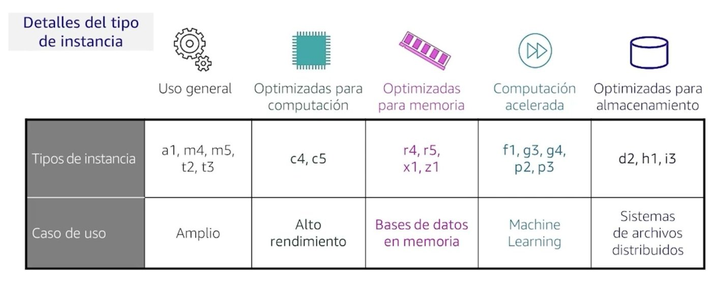{ width="700" }

| Familia | Ejemplos | Caso de uso |
|---|---|---|
| **Uso general** | a1, m4, m5, t2, t3 | Amplio (servidores web, desarrollo…) |
| **Optimizadas para computación** | c4, c5 | Alto rendimiento de CPU |
| **Optimizadas para memoria** | r4, r5, x1, z1 | Bases de datos en memoria |
| **Computación acelerada** | f1, g3, g4, p2, p3 | Machine Learning (GPU) |
| **Optimizadas para almacenamiento** | d2, h1, i3 | Sistemas de archivos distribuidos |

!!! tip "Cómo leer el nombre"
    En `t2.micro`, la **letra** es la familia (`t` = uso general con ráfagas), el **número** es la generación y lo que va **tras el punto** es el tamaño (`nano`, `micro`, `small`, `medium`, `large`…).

### Security Groups

Los **grupos de seguridad** son un **cortafuegos virtual** que controla el tráfico que **entra y sale** de las instancias EC2.

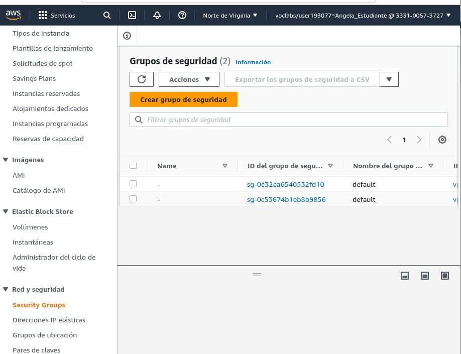{ width="600" }

Para nuestro servidor web crearemos el grupo `web-server` en la VPC `iso` con estas **reglas de entrada**:

| Tipo | Protocolo | Puerto | Origen |
|---|---|---|---|
| HTTP | TCP | 80 | `0.0.0.0/0` (cualquiera) |
| HTTPS | TCP | 443 | `0.0.0.0/0` (cualquiera) |
| SSH | TCP | 22 | **Mi IP** |

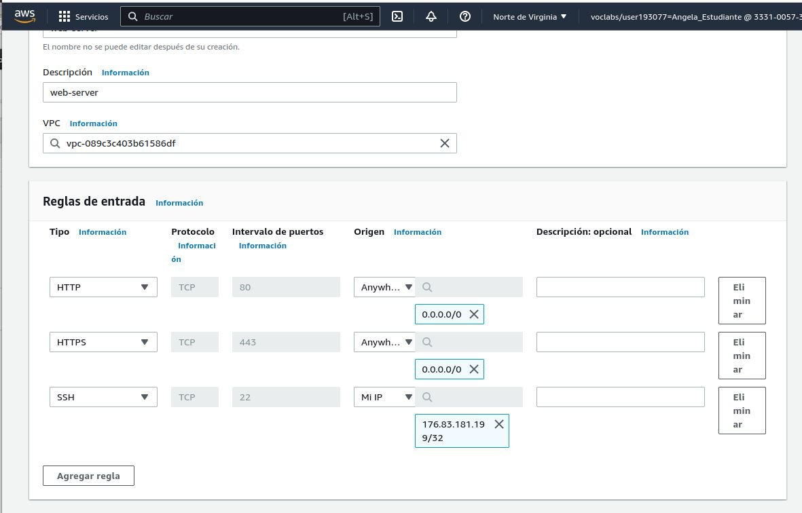{ width="700" }

!!! warning "Seguridad"
    Limita siempre **SSH a tu IP** ("Mi IP"). Abrir el puerto 22 a todo Internet es una mala práctica.

### Direcciones IP elásticas

Una **IP elástica** es una **IP pública estática** que se puede asociar a una instancia EC2 y desasociarla fácilmente en cualquier momento.

!!! info "¿Por qué usarla?"
    La IP pública normal de una instancia **cambia cada vez que la detienes y arrancas**. La IP elástica es fija, así que es la que usaremos para un servidor.

Se crea en **EC2 → Direcciones IP elásticas → Asignar la dirección IP elástica**:

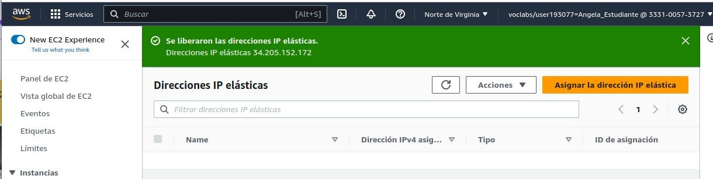{ width="700" }

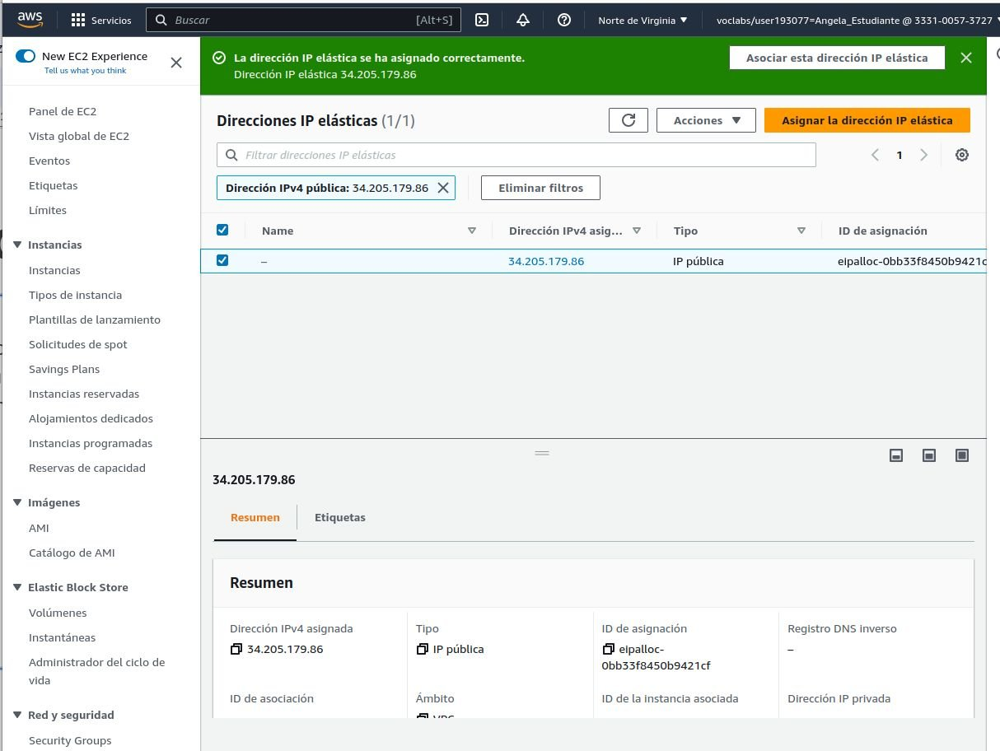{ width="550" }

!!! warning "Coste"
    Las IP elásticas tienen coste. Cuando termines la práctica, **libérala** (Acciones → Liberar direcciones IP elásticas).

### 🧪 Ejercicio 4: Crear una instancia EC2

**1.** Ve a **EC2 → Instancias → Lanzar instancias**.

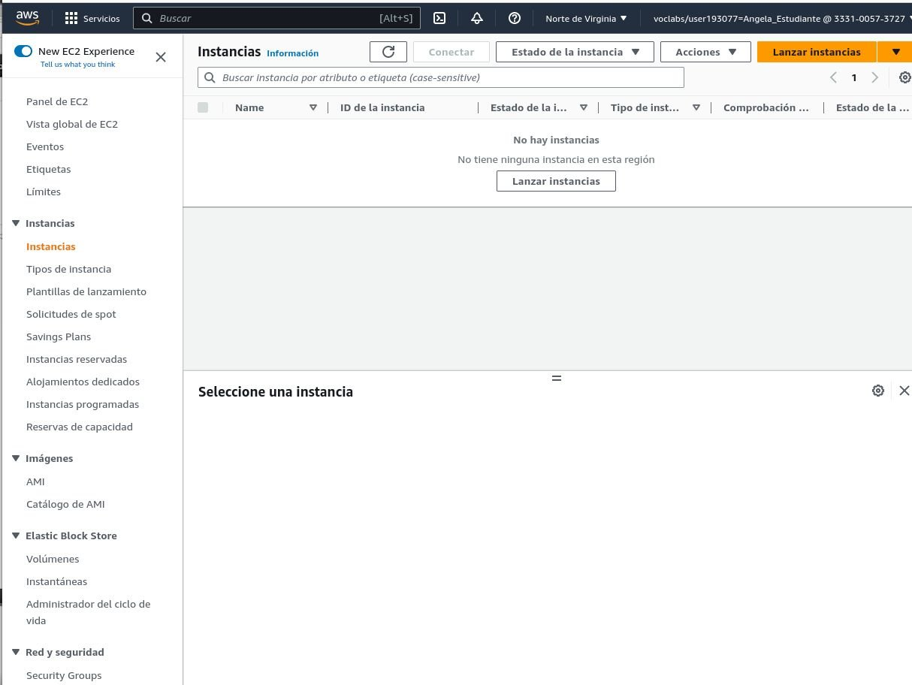{ width="600" }

**2.** Configura la instancia:

| Opción | Valor |
|---|---|
| Nombre | `web-server` |
| AMI | **Amazon Linux 2023** (apta para la capa gratuita) |
| Tipo de instancia | `t2.micro` |
| Par de claves | Crear uno nuevo: `mi_clave`, tipo **RSA**, formato **.pem** |

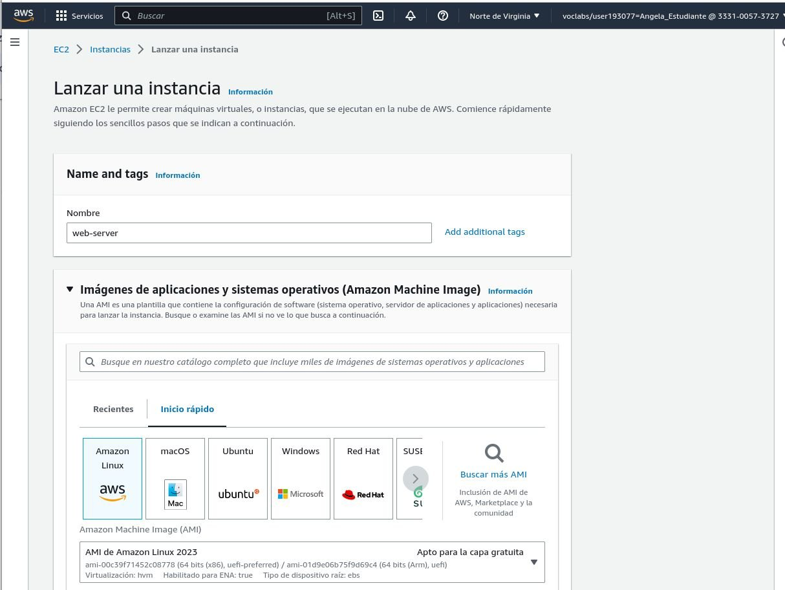{ width="450" } 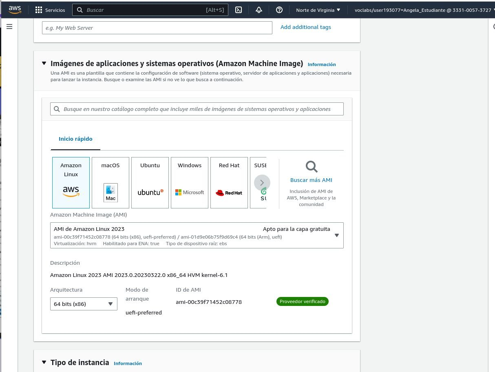{ width="450" }

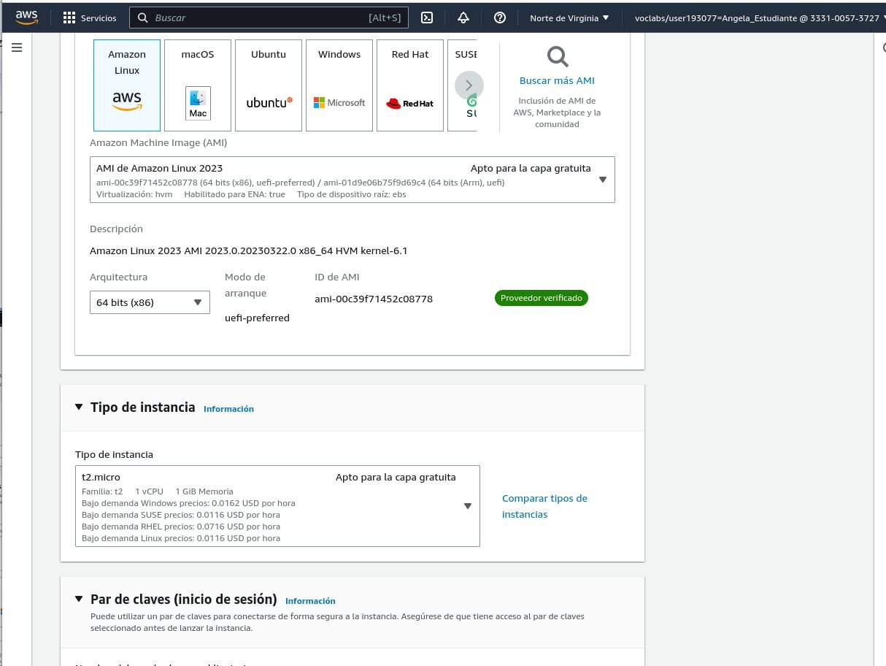{ width="450" }

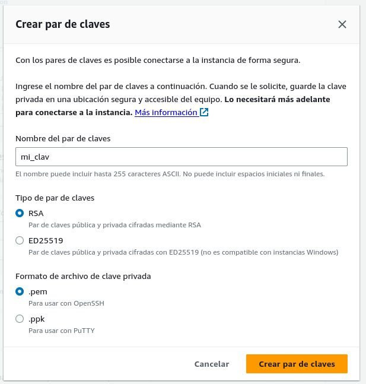{ width="400" } 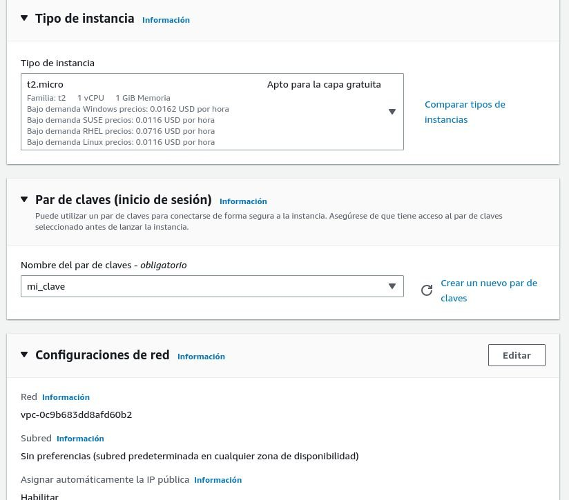{ width="450" }

!!! warning "Guarda la clave"
    El archivo `mi_clave.pem` se descarga **una sola vez**. Guárdalo bien: sin él no podrás conectarte a la instancia.

**3.** En **Configuraciones de red → Editar**:

| Opción | Valor |
|---|---|
| VPC | `iso` |
| Subred | `public1` |
| Asignar automáticamente la IP pública | Habilitar |
| Firewall | Seleccionar grupo existente → `web-server` |

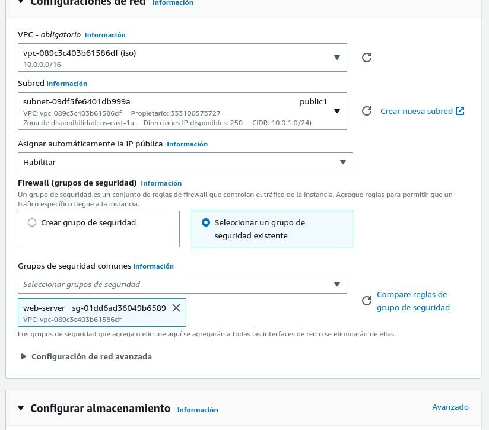{ width="500" } 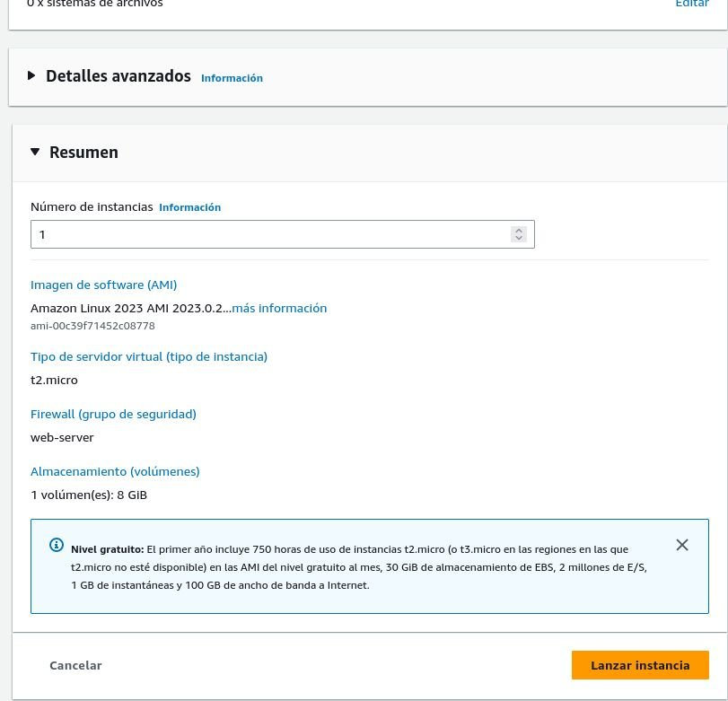{ width="450" }

**4.** Revisa el resumen y pulsa **Lanzar instancia**.

**5. Asociar la IP elástica:** en **Direcciones IP elásticas**, selecciona la IP → **Asociar la dirección IP elástica** → tipo de recurso **Instancia** → elige tu instancia → **Asociar**.

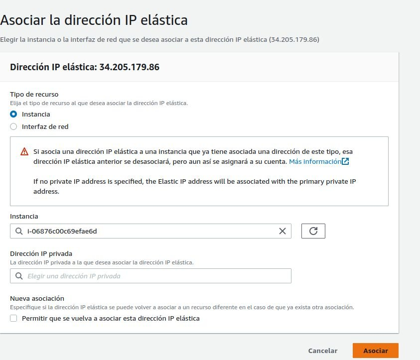{ width="450" }

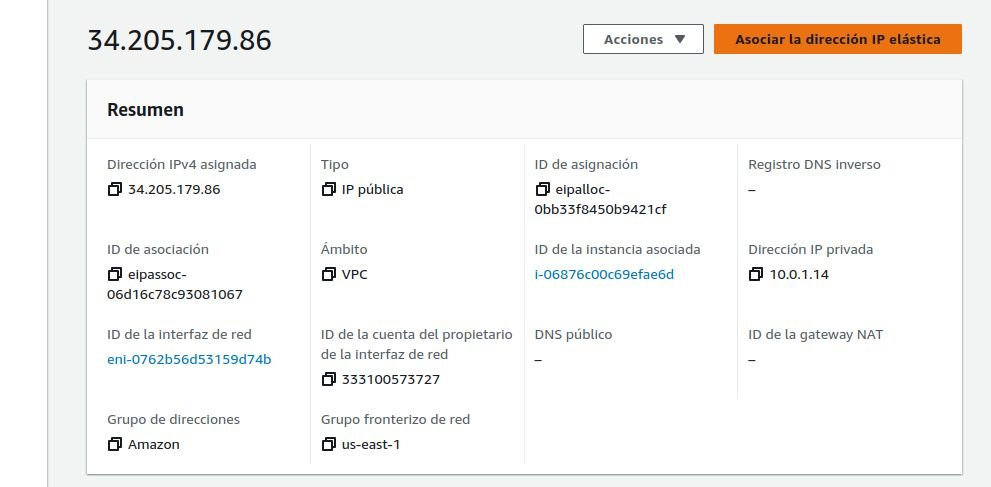{ width="650" }

**6. Conectarse por SSH** desde tu equipo, en la carpeta donde está la clave:

```bash
chmod 400 mi_clave.pem
ssh -i mi_clave.pem ec2-user@IP_ELASTICA
```

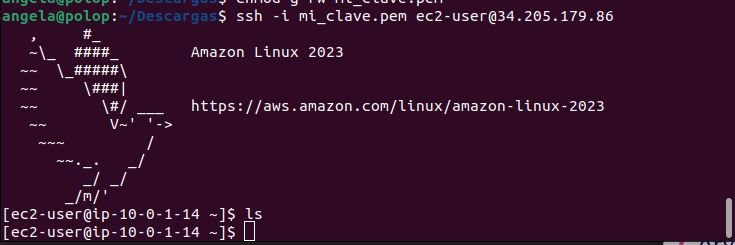{ width="650" }

!!! tip "Desde Windows"
    En PowerShell también funciona `ssh -i mi_clave.pem ec2-user@IP_ELASTICA`. El usuario de Amazon Linux es **`ec2-user`**; en Ubuntu sería **`ubuntu`**.

### 🧪 Ejercicio 5: Instalar un servidor web

Dentro de la instancia, instalamos y arrancamos **Apache** (`httpd`):

```bash
sudo dnf update
sudo dnf install httpd
sudo systemctl start httpd
sudo systemctl enable httpd
```

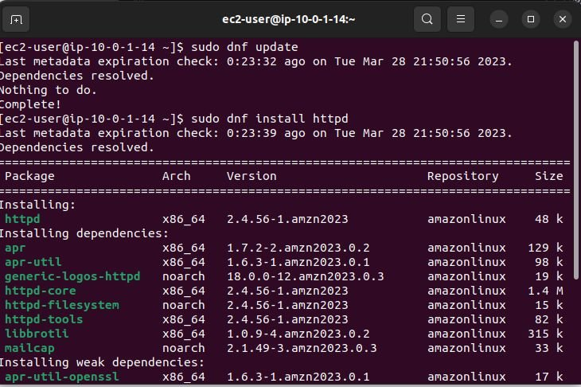{ width="600" }

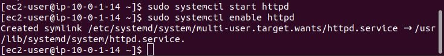{ width="650" }

Abre en el navegador `http://IP_ELASTICA` y deberías ver:

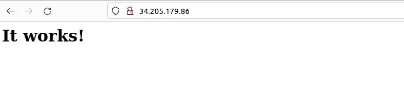{ width="550" }

!!! note "Usa http, no https"
    Todavía no hemos configurado un certificado, así que accede con **`http://`**. Si el navegador fuerza `https://`, no cargará.

---

## Elastic Block Store (EBS)

Los volúmenes **EBS** son los **discos** de AWS.

- Al crear una instancia EC2 se crea un volumen para el sistema (8 GiB por defecto).
- Podemos **crear discos de datos** después y asociarlos a la instancia.

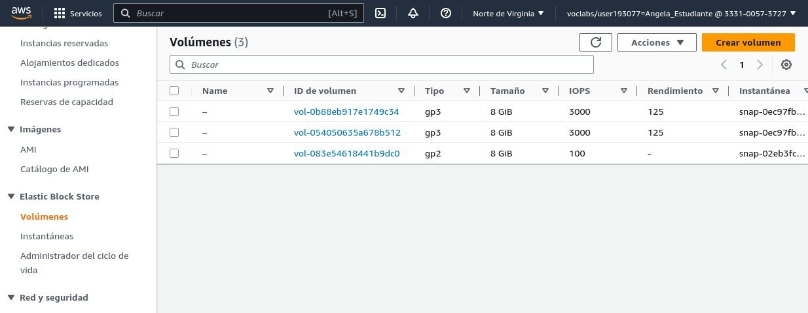{ width="650" }

Para **asociar un volumen**: créalo en **EC2 → Volúmenes → Crear volumen**, selecciónalo y ve a **Acciones → Asociar volumen**.

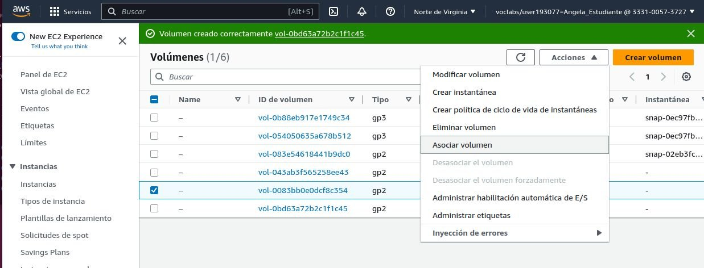{ width="650" }

!!! warning "Misma zona de disponibilidad"
    Un volumen EBS solo se puede asociar a instancias de **su misma zona de disponibilidad**. Créalo en la misma AZ que la instancia (por ejemplo, `us-east-1a`).

---

## Balanceo de carga y Auto Scaling

### Elastic Load Balancer (ELB)

Servicio gestionado que **reparte el tráfico entre varias instancias EC2**, aumentando la **disponibilidad** y la **resiliencia** de las aplicaciones. Soporta HTTP y HTTPS (capa 7) y TCP (capa 4).

| Tipo | Capa | Uso |
|---|---|---|
| **Application Load Balancer (ALB)** | 7 | Aplicaciones web (el que usaremos) |
| **Network Load Balancer (NLB)** | 4 | Alta velocidad y baja latencia |
| **Gateway Load Balancer (GWLB)** | 3 | *Appliances* virtuales (firewalls, etc.) |

### Auto Scaling Group (ASG)

- Grupo de instancias EC2 **gestionado automáticamente**.
- **Escala** según políticas (uso de CPU, tráfico…).
- **Escalado horizontal:** más carga → más instancias.
- **Escalado hacia abajo:** menos carga → menos instancias → **ahorro de costes**.

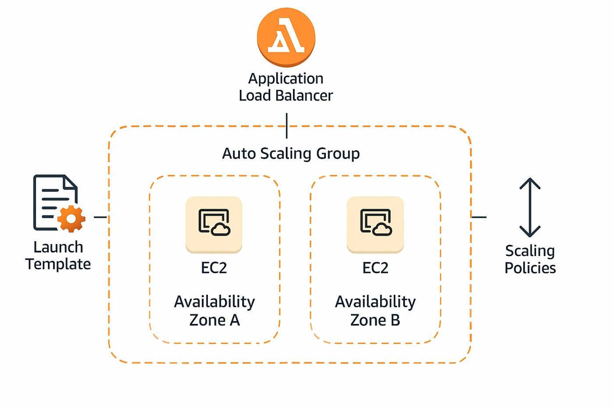{ width="500" }

### 🧪 Ejercicio 6: Configurar un Application Load Balancer

**Objetivo:** balancear el tráfico entre **2 instancias EC2** con servidor web en **zonas de disponibilidad distintas**.

#### Paso 1: Crear una imagen (AMI) de tu instancia

1. Ve a **EC2 → Instancias** y selecciona la instancia con el servidor web.
2. **Acciones → Imagen y plantillas → Crear imagen**.
3. Nombre: `web-server-image`.
4. Deja las opciones por defecto y pulsa **Crear imagen**.

#### Paso 2: Crear una plantilla de lanzamiento

En **EC2 → Plantillas de lanzamiento → Crear plantilla de lanzamiento**:

| Opción | Valor |
|---|---|
| Nombre | `lt-web-server` |
| AMI | **Mis AMI** → `web-server-image` |
| Tipo de instancia | `t2.micro` |
| Par de claves | `mi_clave` |
| Red | Tu VPC, pero **sin elegir subred** (se elige en el Auto Scaling) |
| Grupo de seguridad | `web-server` (permite HTTP) |

#### Paso 3: Crear el Application Load Balancer

En **EC2 → Balanceadores de carga → Crear balanceador de carga → Balanceador de carga de aplicaciones**:

| Opción | Valor |
|---|---|
| Nombre | `web-alb` |
| Esquema | Expuesto a Internet |
| Tipo de dirección IP | IPv4 |
| VPC | `iso` |
| Zonas y subredes | Las **dos** zonas con `public1` y `public2` |
| Grupo de seguridad | `web-server` |
| Agente de escucha | HTTP : 80 (por defecto) |

**Crear el grupo de destino** (desde el enlace del agente de escucha):

| Opción | Valor |
|---|---|
| Tipo | Instancias |
| Nombre | `tg-web-autoscaling` |
| Protocolo / puerto | HTTP / 80 |
| VPC | `iso` |
| Instancias | **Ninguna** por ahora (las añadirá el Auto Scaling) |

Vuelve al balanceador, selecciona el grupo de destino `tg-web-autoscaling` y pulsa **Crear balanceador de carga**.

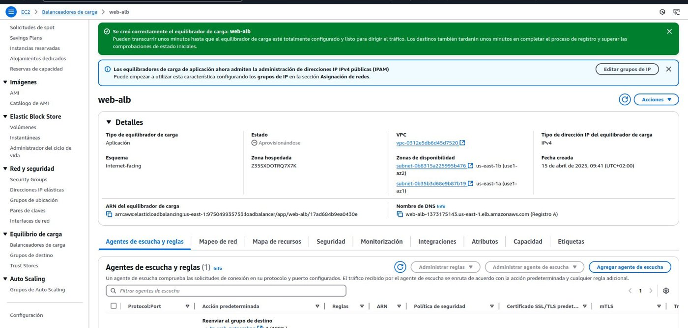{ width="750" }

### 🧪 Ejercicio 7: Crear un Auto Scaling Group

#### Paso 1: Crear el grupo

En **EC2 → Grupos de Auto Scaling → Crear grupo de Auto Scaling**:

- Nombre: `asg-web-balancer`
- Plantilla de lanzamiento: `lt-web-server`

#### Paso 2: Red

- VPC: `iso`
- Subredes: `public1` y `public2`

#### Paso 3: Asociar al balanceador

- Elige **Asociar a un balanceador de carga existente**.
- Grupo de destino: `tg-web-autoscaling`.
- **Opciones de integración de VPC Lattice:** déjalo en *No hay ningún servicio de VPC Lattice*; no hace falta para este ejercicio.

#### Paso 4: Tamaño del grupo y escalado

| Opción | Valor | Significado |
|---|---|---|
| Capacidad deseada | **2** | 2 instancias activas de inicio, una en cada AZ |
| Capacidad mínima | **1** | Nunca bajará de 1 instancia |
| Capacidad máxima | **4** | Nunca pasará de 4 instancias |
| Escalado automático | **Política de seguimiento de destino** | |
| Métrica | Utilización promedio de la CPU | |
| Valor objetivo | **60 %** | Añade o quita instancias para mantenerse cerca de ese valor |

Con la política de seguimiento de destino, AWS crea automáticamente el escalado **hacia arriba y hacia abajo**, sin escribir condiciones a mano.

Pulsa **Siguiente**, deja el resto por defecto y **Crear grupo de Auto Scaling**.

### ✅ Verificaciones finales

**El Auto Scaling Group debe** tener **2 instancias** en la pestaña *Administración de instancias*, con ciclo de vida **`InService`** y estado **`Healthy`**.

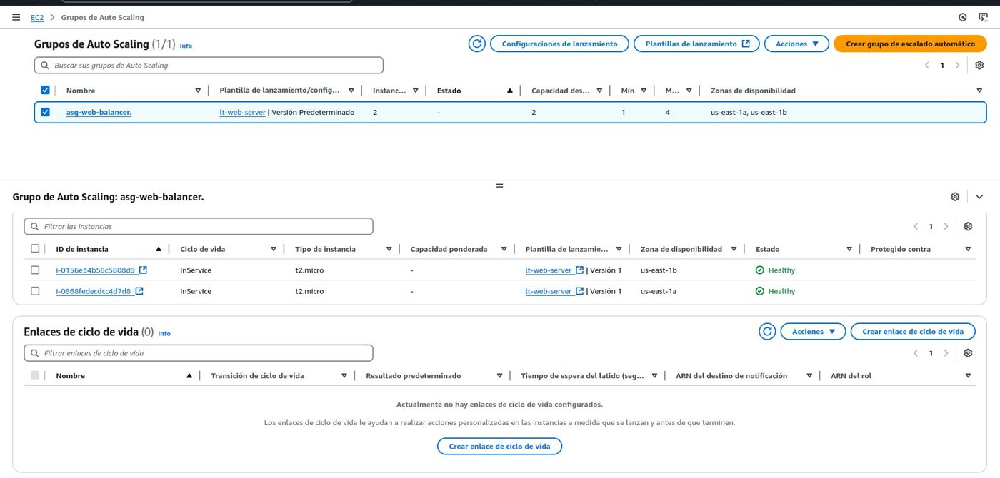{ width="750" }

**El Load Balancer debe** mostrar **2 instancias registradas y *healthy*** en el grupo de destino `tg-web-autoscaling`.

!!! tip "Prueba final"
    Copia el **Nombre de DNS** del balanceador (algo como `web-alb-123456.us-east-1.elb.amazonaws.com`) y ábrelo en el navegador con `http://`. Deberías ver tu servidor web, servido por cualquiera de las dos instancias.

!!! danger "Al terminar"
    Para no gastar créditos, **elimina** en este orden: el grupo de Auto Scaling, el balanceador de carga, el grupo de destino, las instancias y la IP elástica.

---

## 📌 Resumen

| Término | Definición |
|---|---|
| **Región** | Área geográfica con varias zonas de disponibilidad. |
| **Zona de disponibilidad (AZ)** | Centros de datos aislados dentro de una región. |
| **VPC** | Red privada virtual y aislada, de alcance regional. |
| **Subred** | Segmento de la VPC, de alcance zonal. Pública si tiene ruta al IGW. |
| **Tabla de enrutamiento** | Define hacia dónde va el tráfico de las subredes asociadas. |
| **Internet Gateway** | Conecta la VPC con Internet. Uno por VPC. |
| **EC2** | Máquinas virtuales (instancias) de AWS. |
| **AMI** | Imagen/plantilla con el sistema operativo para crear instancias. |
| **Security Group** | Cortafuegos virtual de las instancias. |
| **IP elástica** | IP pública fija que se puede mover entre instancias. |
| **EBS** | Discos (volúmenes) de las instancias. Van ligados a una AZ. |
| **ELB / ALB** | Balanceador de carga que reparte el tráfico entre instancias. |
| **Auto Scaling Group** | Grupo que añade o quita instancias automáticamente según la carga. |
